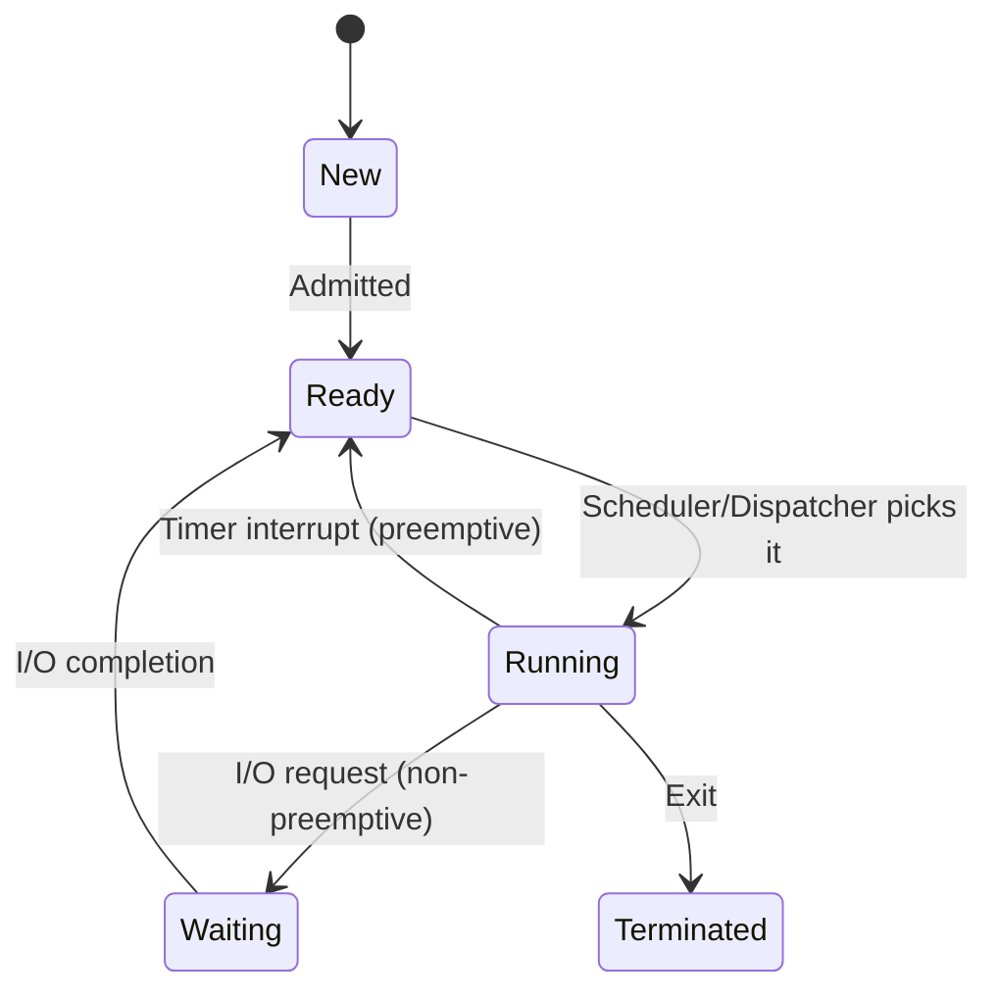
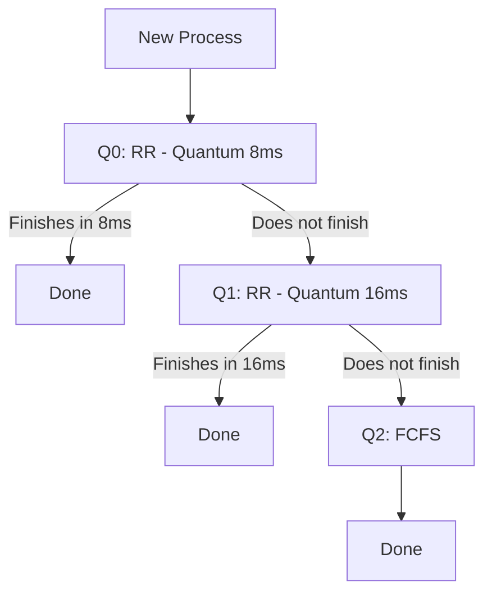

Welcome! This lecture is the **heart of an Operating System**. It answers one critical question: *"Out of all the processes waiting to run, which one gets the CPU right now?"* 

Think of the CPU as a **super-fast chef** in a busy restaurant. The kitchen (CPU) can only cook one dish at a time, but orders (processes) keep flooding in. The *Scheduler* is the **expediter** who decides which order goes on the stove next. Let's master how that expediter makes decisions.

---

## Topic 1: The CPU-I/O Burst Cycle & The Scheduler (Basics)

### Simple Explanation
A program doesn't just run straight from start to finish. It alternates between **two states**: 
- **CPU Burst**: The process is doing calculations (e.g., adding numbers, looping).
- **I/O Burst**: The process is waiting for something slow (e.g., reading a file from a hard drive, waiting for you to type on the keyboard).

Processes constantly jump back and forth: *Compute → Wait for Disk → Compute → Wait for Network → Terminate*.

The **CPU scheduler** is the OS component that picks which process in the "Ready Queue" (the waiting room) gets the CPU core next.

---

### Why Do We Need It?
Without scheduling, the first process that shows up would hog the CPU forever. If that process does an I/O operation (which takes millions of CPU cycles), the CPU would just sit there idle—**wasting 99% of its power**. Scheduling allows *multiprogramming*—switching between processes so that when one waits for I/O, the CPU works on another.

---

### How It Works (Step-by-Step)
1. A process executes for a while (CPU burst).
2. It requests an I/O operation (disk read, keyboard input) and moves to the *Waiting* state.
3. The CPU is now free. The **Scheduler** looks at the *Ready Queue*.
4. The Scheduler picks a process and hands it to the **Dispatcher**.
5. The **Dispatcher** does the actual "context switch" (saves the old process's state, loads the new one) and starts the new process.

---

### Visual (Flow of States)


---

### Preemptive vs Non-Preemptive (Crucial Slide 7)
- **Non-preemptive**: The process keeps the CPU until it *voluntarily* gives it up (e.g., waiting for I/O or terminating). Simple, but if a long process runs first, everyone else starves.`Under Non-preemptive scheduling, once the CPU has been
allocated to a process, the process keeps the CPU until it
releases it either by terminating or by switching to the waiting
state.`

- **Preemptive**: The OS forces the process to give up the CPU (usually via a hardware **timer interrupt**). This is used by *Windows, Linux, and macOS* because it ensures no single process can monopolize the system.

**Memory Trick**: *"Preemptive = Power to the OS to forcefully evict."*

---

### Exam Focus
- **Definition**: CPU burst vs. I/O burst.
- **Difference**: Preemptive vs. Non-preemptive scheduling.
- **Definition**: Dispatcher latency (the time it takes to stop one process and start another).

---

## Topic 2: Scheduling Criteria (The 5 Metrics)

### Simple Explanation
How do we decide if a scheduling algorithm is "good"? We use 5 stopwatches to measure performance:

1.  **CPU Utilization** – Keep the CPU busy 24/7 (we want ~100%).
2.  **Throughput** – Number of processes completed per hour (e.g., finishing 10 homework assignments per day).
3.  **Turnaround Time** – Total time from *process arrival* to *process completion* (how long from walking into the restaurant to getting your check).
4.  **Waiting Time** – Total time a process spends *just sitting in the ready queue* (does not include CPU or I/O time).
5.  **Response Time** – Time from *submitting a request* until the *first output* appears (for interactive apps, this is more important than turnaround).

---

### Why Do We Need It?
These metrics are conflicting. To maximize throughput, you might favor short jobs (making long jobs starve). To minimize response time, you might interrupt jobs too frequently (increasing overhead). We use these to mathematically compare algorithms.

---

### Real-Life Analogy (Bank Teller)
- **Turnaround**: Time from entering the bank to leaving with cash.
- **Waiting Time**: Time spent standing in the line.
- **Response Time**: Time until the teller says "Hello, how can I help?" (first interaction).


## Scheduling Algorithm Optimization Criteria

- Max CPU utilization
- Max throughput
- Min turnaround time
- Min waiting time
- Min response time


---

### Exam Focus
- **Numerical Formula**: 
  - `Turnaround = Completion Time – Arrival Time`
  - `Waiting Time = Turnaround – (Total CPU Burst Time)`
- **Conceptual**: Why is minimizing Response Time important for video games, but maximizing Throughput important for web servers?

---

## Topic 3: FCFS (First-Come, First-Served) & The Convoy Effect

### Simple Explanation
Just like a queue at a ticket counter—whoever arrives first gets the CPU first. It is strictly **non-preemptive**.

---


### Worked Example (From Slide 11)


Processes: P1 (Burst=24), P2 (Burst=3), P3 (Burst=3). Arrival order: P1 → P2 → P3.

**Gantt Chart**: 

```text
| P1 | P2 | P3 |
| 0---24---27---30|
```

- Turnaround: P1=24, P2=27, P3=30.
- Waiting Time: P1=0, P2=24, P3=27. **Average = (0+24+27)/3 = 17 ms**.

Now, if we change the order to P2 → P3 → P1:
| P2 | P3 | P1 |
| 0---3---6---30|
- Waiting Time: P1=6, P2=0, P3=3. **Average = 3 ms**.

This illustrates the **Convoy Effect**: A short process stuck behind a long, CPU-hogging process (the "convoy" of small trucks behind a slow tractor). FCFS is terrible for interactive systems.

---

### Memory Trick
*"FCFS is fair but slow—it's the DMV line."*

---

## Topic 4: SJF (Shortest-Job-First) & Exponential Averaging

### Simple Explanation
**SJF** is the theory of "do the shortest task first." If you have a 3-minute task and a 24-minute task, doing the small one first drastically reduces average waiting time. SJF is *optimal* for minimizing average waiting time (mathematically proven).

---

### How It Works
- **Non-preemptive SJF**: Once a process gets the CPU, it runs to completion, even if a shorter one arrives later.
- **The Problem**: We don't know the *future*. How do we know which process is the "shortest"?
- **Solution**: We **predict** the next CPU burst using past behavior. This is done via **Exponential Averaging**.

### The Formula (Slide 15)
```
τ(n+1) = α * t(n) + (1 - α) * τ(n)
```
- `t(n)` = Actual burst time of the *nth* CPU burst.
- `τ(n)` = *Predicted* burst time for the *nth* CPU burst.
- `α` (Alpha) = A weight between 0 and 1. Usually set to 1/2.


**Interpretation**:
- If **α = 0**: The past doesn't matter; our guess stays the same forever (bad).
- If **α = 1**: Only the last burst matters (too volatile).
- **α = 0.5** gives equal weight to recent and past history.

---

### Worked Example (Slide 14 - Non-preemptive SJF)


Processes: P1(6), P2(8), P3(7), P4(3). Arrive at time 0.

**Gantt Chart**: 
```text
| P4(3) | P1(6) | P3(7) | P2(8) |
| 0------3------9------16------24|
```
- Waiting: P4=0, P1=3, P3=9, P2=16. **Avg = (0+3+9+16)/4 = 7 ms**. (Much better than FCFS if P2/P3 came first).

---

### Industry Connection
- Linux's O(1) scheduler and CFS use heuristics based on sleep times (which mimics predicting when a process will wake up).

---

## Topic 5: SRTF (Shortest Remaining Time First) – The Preemptive SJF

### Simple Explanation
This is SJF on steroids. It is **preemptive**. If a new process arrives with a *shorter* remaining time than the currently running process, the CPU is immediately yanked away from the current one and given to the new one. This gives the absolute minimum average waiting time.

---

### Worked Example (Slide 19 - High Difficulty)


| Process | Arrival Time | Burst Time |
|---------|--------------|------------|
| P1      | 0            | 8          |
| P2      | 1            | 4          |
| P3      | 2            | 9          |
| P4      | 3            | 5          |

**Step-by-Step Gantt Logic**:
1.  **Time 0-1**: Only P1 exists. Runs P1. (Remaining P1=7).
2.  **Time 1**: P2 arrives (Burst=4). P1 has 7 left. P2 (4) is shorter. **Preempt P1!** Run P2.
3.  **Time 2**: P3 arrives (9). P2 has 3 left. 3 is less than 9 and 7. Continue P2.
4.  **Time 3**: P4 arrives (5). P2 has 2 left. 2 is the shortest. Continue P2.
5.  **Time 5**: P2 finishes. Now ready queue has P1(7), P3(9), P4(5). Shortest is P4(5). Run P4 until 10.
6.  **Time 10**: P4 finishes. Ready: P1(7), P3(9). Run P1 until 17.
7.  **Time 17**: Run P3 until 26.

**Gantt**: | P1 | P2 | P2 | P2 | P4 | P4 | P4 | P4 | P4 | P1... | P3... |
*Simplified Chart*: 0-1 (P1), 1-5 (P2), 5-10 (P4), 10-17 (P1), 17-26 (P3).

**Calculating Waiting Time** (Tricky!):
- **P1**: Ran at 0-1 (1ms). Finished at 17. Total time = 17. Burst = 8. Waiting = 17 - 8 = 9? Wait, let's use Arrival. Wait = (Completion - Arrival) - Burst = (17-0) - 8 = 9. (Check slide: they wrote (10-1)? Let's re-evaluate). Slide says `(10-1) + (1-1) + (17-2) + (5-3)`. Let's trust the slide's Gantt: P1 runs 0-1, P2 runs 1-5, P4 runs 5-10, P1 runs 10-17, P3 runs 17-26.
  - **P1**: Completion 17. Wait = (17-0) - 8 = 9.
  - **P2**: Completion 5. Wait = (5-1) - 4 = 0.
  - **P3**: Completion 26. Wait = (26-2) - 9 = 15.
  - **P4**: Completion 10. Wait = (10-3) - 5 = 2.
  Avg = (9+0+15+2)/4 = 6.5. **Matches the slide!**

---

### Key Insight
SRTF has the **lowest average waiting time** theoretically, but it causes *starvation* (long jobs might wait forever) and *high overhead* (constant context switching).

---

## Topic 6: Round Robin (RR) – The Fairness King

### Simple Explanation
Everyone gets a slice of the CPU. The OS sets a **Time Quantum** (e.g., 10 milliseconds). The process runs for that slice. If it doesn't finish, it goes to the *back of the line*. This is the most **responsive** algorithm for time-sharing systems (like your laptop).

---

### How It Works
1.  Process runs for `q` milliseconds.
2.  Timer interrupt fires.
3.  Process is placed at the tail of the Ready Queue.
4.  CPU switches to the next process in the queue.

---

### Worked Example (Slide 22)

Quantum = 4. Processes: P1(24), P2(3), P3(3).
**Gantt**: 
| P1 | P2 | P3 | P1 | P1 | P1 | P1 |
| 0--4--7--10--14--18--22--26|
- Turnaround: P1=26, P2=7, P3=10. Average = 43/3 = 14.33 ms.
- Waiting: P1 = (0-0)+(10-4)+(14-10)+(18-14)+(22-18) = 0+6+4+4+4 = 18? Let's use formula: Turnaround - Burst = 26-24 = 2? Wait, 26-24=2. That's not right because it runs multiple times.
Let's sum waiting: At 0-4 runs (no wait). At 4-7 P2, 7-10 P3, 10-14 P1 (waited from 4 to 10 = 6). 14-18 P1 (waited 14-18? No, it ran). Let's calculate properly: 
Completion times: P1=22, P2=7, P3=10.
Turnaround: P1=22, P2=7, P3=10. 
Waiting = Turnaround - Burst. P1 = 22 - 24 = -2 (impossible). The chart shows P1 finishes at 26? Let's look at slide: P1 runs 0-4, then 10-14, 14-18, 18-22, 22-26. Yes completion is 26. Wait = 26 - 24 = 2. P2 wait = 7 - 3 = 4. P3 wait = 10 - 3 = 7. Avg = (2+4+7)/3 = 4.33. (Slide says "Typically higher average turnaround" - they mean compared to SJF, which was much lower.)

---

### The "Quantum" Trade-Off
- **q large** (e.g., 100ms) → Acts like FCFS (poor response).
- **q small** (e.g., 1ms) → Acts like many context switches (high overhead).
**Rule of Thumb**: 80% of CPU bursts should be shorter than the time quantum.

---

## Topic 7: Priority Scheduling & Aging

### Simple Explanation
Assign a number (priority) to each process. The CPU always runs the process with the highest priority (lowest number = highest priority, usually). This can be **preemptive** or **non-preemptive**.

---

### The Fatal Flaw: Starvation
Low-priority processes might **never** run if high-priority processes keep arriving.
**The Fix: Aging** – Slowly increase the priority of waiting processes over time. Eventually, even the lowest priority process gets bumped up high enough to run.

---

### Worked Example (Slide 26)


| Process | Burst | Priority |
|---------|-------|----------|
| P1      | 10    | 3        |
| P2      | 1     | 1        |
| P3      | 2     | 4        |
| P4      | 1     | 5        |
| P5      | 5     | 2        |

Priority (1=highest). Order: P2 (1), P5 (2), P1 (3), P3 (4), P4 (5).
**Gantt**: | P2 | P5 | P1 | P3 | P4 |
| 0--1--6--16--18--19|
Waiting: P1=6, P2=0, P3=16, P4=18, P5=1. Avg = (6+0+16+18+1)/5 = 8.2 ms.

---

## Topic 8: Multilevel Queue & Multilevel Feedback Queue (MLFQ)

### Simple Explanation
Why use one queue when you can use many? In **Multilevel Queue**, processes are permanently assigned to a queue based on their type (e.g., System processes go to Queue 0, Interactive to Queue 1, Batch to Queue 2). Queue 0 has highest priority (strict). 


**MLFQ** is smarter. Processes can **move** between queues. This is the **most practical algorithm**.

---

### Visualizing MLFQ (Slide 32)



**How it works**: 
1.  New process starts in the highest priority queue (`Q0`) with a short time slice.
2.  If it completes quickly, it's obviously interactive/important—it stays high priority.
3.  If it uses too much CPU, it's CPU-bound. We **demote** it to a lower queue (`Q1`) with a larger quantum.
4.  If it still runs long, it drops to `Q2` (FCFS) where it runs slowly.
This prevents **starvation** (aging is built-in by promoting processes that wait too long).


## Example of Multilevel Feedback Queue


---

## Topic 9: Thread Scheduling (PCS vs SCS)

### Simple Explanation
When a program uses threads, the OS doesn't schedule the *process*—it schedules the *threads*. But how?

- **PCS (Process-Contention Scope)**: The fight is *inside* your program. The thread library (like pthreads) decides which user-level thread gets to run on a "Virtual CPU" (LWP). The OS doesn't see these threads.
- **SCS (System-Contention Scope)**: The fight is *system-wide*. The OS kernel decides which kernel-level thread gets the actual CPU core.


---

### Real-Life Analogy
Think of PCS as a **local gym** (your process) deciding who uses the treadmill *within that gym*. SCS is the **city government** deciding which gym gets electricity (CPU) on the main power grid.

---

### Pthread Code Details (Slides 36-37)
- `PTHREAD_SCOPE_PROCESS` → Uses PCS.
- `PTHREAD_SCOPE_SYSTEM` → Uses SCS.
- *Linux note*: Linux only supports `PTHREAD_SCOPE_SYSTEM`—meaning the OS schedules all threads directly.

## Pthread Scheduling API (Prepare for Lab)

```c
#include <pthread.h>
#include <stdio.h>
#define NUM_THREADS 5
int main(int argc, char *argv[])
{
    int i, scope;
    pthread_t tid[NUM THREADS];
    pthread_attr_t attr;
    /* get the default attributes */
    pthread_attr_init(&attr);
    /* first inquire on the current scope */
    if (pthread_attr_getscope(&attr, &scope) != 0)
        fprintf(stderr, "Unable to get scheduling scope\n");
    else
    {
        if (scope == PTHREAD_SCOPE_PROCESS)
            printf("PTHREAD_SCOPE_PROCESS");
        else if (scope == PTHREAD_SCOPE_SYSTEM)
            printf("PTHREAD_SCOPE_SYSTEM");
        else
            fprintf(stderr, "Illegal scope value.\n");
    }
    /* set the scheduling algorithm to PCS or SCS */
    pthread_attr_setscope(&attr, PTHREAD_SCOPE_SYSTEM);
    /* create the threads */
    for (i = 0; i < NUM_THREADS; i++)
        pthread_create(&tid[i], &attr, runner, NULL);
    /* now join on each thread */
    for (i = 0; i < NUM_THREADS; i++)
        pthread_join(tid[i], NULL);
}
/* Each thread will begin control in this function */
void *runner(void *param)
{
    /* do some work ... */
    pthread_exit(0);
}
```
---

### Industry Connection
- **Windows** uses SCS (all threads are kernel-level).
- **Solaris** historically supported both.

---

# Final Lecture Revision Sheet

## Must Remember Definitions (7)
1.  **CPU Burst**: Time spent computing.
2.  **Dispatcher Latency**: Time to perform a context switch.
3.  **Turnaround Time**: Completion - Arrival.
4.  **Waiting Time**: Turnaround - CPU Burst Time.
5.  **Convoy Effect**: Short processes stuck behind a long one (FCFS issue).
6.  **Aging**: Gradually increasing priority of a process to prevent starvation.
7.  **Time Quantum**: The maximum time a process runs in Round Robin before preemption.

## Most Important Concepts (5)
1.  **Preemption** vs **Non-preemption** (Interrupts vs Voluntary yield).
2.  **SJF** is optimal for *average* waiting time, but **SRTF** is even better (preemptive version).
3.  **Round Robin** is best for *response time* but worse for *turnaround*.
4.  **MLFQ** is the "real-world" solution—combines RR, Priority, and Aging.
5.  **SCS** vs **PCS** determines who does the scheduling (OS vs Thread Library).

## Common Exam Traps
- **Trap 1**: In SRTF, when a new process arrives, you must check if its *total* burst is shorter than the *remaining* time of the current process—not the original burst.
- **Trap 2**: In FCFS, waiting time is NOT turnaround time. Waiting time excludes the running time.
- **Trap 3**: "Higher priority" in most OS textbooks means **smaller integer** (e.g., priority 1 > priority 2).
- **Trap 4**: Context switch time is NOT included in Gantt charts unless explicitly stated (though you must mention it in theory).

## One-Page Revision Summary
- **Goal**: Max Utilization, Min Wait/Response.
- **Algorithms**:
    - FCFS: Simple, Non-preemptive, Convoy effect.
    - SJF/SRTF: Optimal wait time, requires prediction (Exponential Averaging), SRTF is preemptive.
    - RR: Fair, Time Quantum (`q`), handles interactive tasks.
    - Priority: Starvation issue, fixed by Aging.
    - MLFQ: Multiple queues, demotes CPU-hogs, promotes waiters (default in many OSes).
- **Threads**: PCS (user-level, within process) vs SCS (kernel-level, system-wide).

## 5 Practice Questions (Without Answers)
1.  Five processes arrive at time 0 with burst times 2, 5, 8, 3, 7. Calculate average waiting time for FCFS, SJF, and RR (Quantum=2).
2.  Explain the "Convoy Effect" and how SJF solves it.
3.  A system uses Multilevel Feedback Queue. Describe the scheduling parameters and explain how it prevents starvation.
4.  Differentiate between Dispatcher and Scheduler.
5.  List the 5 scheduling criteria. Which one is most important for an online gaming server, and why?
