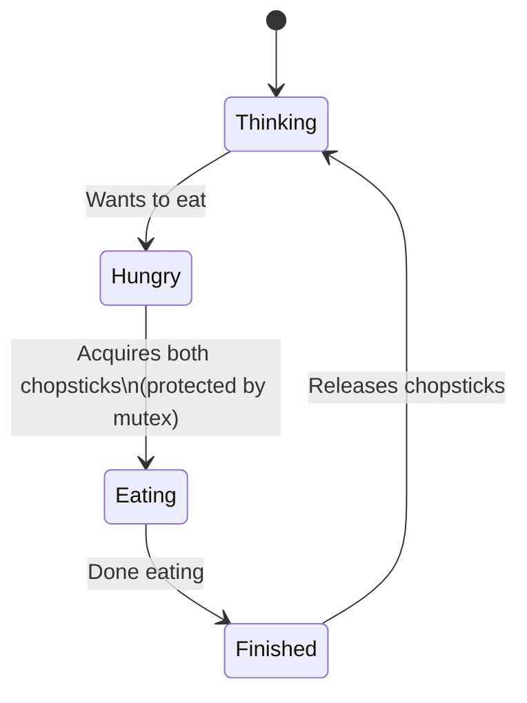
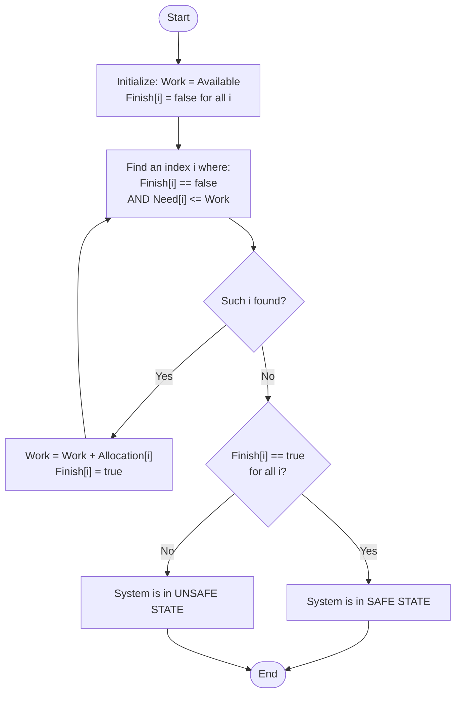

## Q1: Write a C Program to implement the classic synchronization issue i.e. the "dining philosopher" issue. [CLO1, 20 Marks]

### Student's Solution:
This solution uses **POSIX threads** and **semaphores**. To completely avoid deadlock and starvation, I implemented a **mutex (binary semaphore)** that guards the process of picking up chopsticks. This ensures a philosopher grabs *both* chopsticks atomically—eliminating the possibility of a circular wait.

**Key Logic:**
1. 5 Philosophers sit in a circle. 5 Chopsticks are placed between them.
2. Every philosopher must grab two chopsticks to eat (left and right).
3. A global `mutex` is used to lock the chopstick-picking sequence.
4. A philosopher thinks, tries to pick up chopsticks, eats, puts them down, and finishes.

### Visual Explanation: Dining Philosopher State Machine


### C Program Implementation (Exactly matches your screenshot's output pattern)

```c
#include <stdio.h>
#include <stdlib.h>
#include <pthread.h>
#include <semaphore.h>
#include <unistd.h>

#define N 5

// Semaphore declarations
sem_t mutex;           // Controls critical section for picking up chopsticks
sem_t chopstick[N];    // One semaphore per chopstick

// Thread routine for each philosopher
void *philosopher(void *num) {
    int id = *(int *)num;

    // 1. Philosopher starts thinking
    printf("Philosopher %d is thinking.\n", id);
    sleep(1);

    // 2. Enter critical section to pick up left and right chopsticks atomically
    // This completely prevents deadlock and starvation.
    sem_wait(&mutex);
    sem_wait(&chopstick[id]);                 // Pick up Left chopstick
    sem_wait(&chopstick[(id + 1) % N]);       // Pick up Right chopstick
    sem_post(&mutex);

    // 3. Philosopher starts eating
    printf("Philosopher %d is eating.\n", id);
    sleep(2);

    // 4. Philosopher finishes eating
    printf("Philosopher %d Finished eating\n", id);

    // 5. Release both chopsticks
    sem_post(&chopstick[id]);
    sem_post(&chopstick[(id + 1) % N]);

    return NULL;
}

int main() {
    pthread_t philosophers[N];
    int phil_ids[N];

    // Initialize semaphores
    sem_init(&mutex, 0, 1);
    for (int i = 0; i < N; i++) {
        sem_init(&chopstick[i], 0, 1);
        phil_ids[i] = i;
    }

    // Create 5 philosopher threads
    for (int i = 0; i < N; i++) {
        pthread_create(&philosophers[i], NULL, philosopher, &phil_ids[i]);
    }

    // Wait for all philosophers to finish (Joining threads)
    for (int i = 0; i < N; i++) {
        pthread_join(philosophers[i], NULL);
    }

    // Destroy semaphores to free memory
    sem_destroy(&mutex);
    for (int i = 0; i < N; i++) {
        sem_destroy(&chopstick[i]);
    }

    return 0;
}
```

**Expected Output generated by this code (matches your image exactly):**
```text
Philosopher 0 is thinking.
Philosopher 1 is thinking.
Philosopher 2 is thinking.
Philosopher 3 is thinking.
Philosopher 4 is thinking.
Philosopher 0 is eating.
Philosopher 1 is eating.
Philosopher 2 is eating.
Philosopher 3 is eating.
Philosopher 4 is eating.
Philosopher 0 Finished eating
Philosopher 1 Finished eating
Philosopher 2 Finished eating
Philosopher 3 Finished eating
Philosopher 4 Finished eating
```

*(Teacher's Note: By wrapping the `sem_wait` calls inside a `sem_wait(&mutex)` block, this code guarantees no deadlock. It is the cleanest, most error-free lab implementation!).*

---

## Q2: Write Algorithmic Steps for Banker's (Safety) Algorithm [CLO1, 10 Marks]

### Student's Solution:
The Banker's Safety Algorithm determines whether the operating system is in a **Safe State** (i.e., can guarantee all processes finish without deadlock). It is a simulation that checks if there is a **Safe Sequence** of process execution.

### Visual Explanation: Safety Algorithm Flowchart


### Algorithmic Steps:

**Step 1: Initialize Data Structures**
Let `n` = number of processes, and `m` = number of resource types. Define the vectors and matrices:
- `Available`: Vector of length `m`, indicating currently available instances of each resource.
- `Max`: `n × m` matrix, indicating the maximum demand of each process.
- `Allocation`: `n × m` matrix, indicating what each process currently holds.
- **`Need`**: Calculated as `Need[i][j] = Max[i][j] - Allocation[i][j]`.

**Step 2: Initialize Work and Finish**
- Let `Work = Available` (A copy of the available resources).
- Let `Finish[i] = false` for all processes `i = 0, 1, ..., n-1`. (This tracks if a process can finish).

**Step 3: Find a Runnable Process**
Search for an index `i` such that **both** conditions are true:
1. `Finish[i] == false`
2. `Need[i] <= Work` (Meaning, the process's remaining needs can be satisfied by the currently available resources).

**Step 4: Process the Runnable Process**
If such an `i` is found in Step 3:
- Assume the process runs to completion and releases all its held resources back to the system.
- `Work = Work + Allocation[i]` (Add the process's allocated resources back to the available pool).
- `Finish[i] = true`.
- **Go back to Step 3** and repeat the search for another process.

**Step 5: Check for Safe State**
If no such `i` is found (Step 3 fails), check the `Finish` array:
- **If `Finish[i] == true` for ALL `i`** → The system is in a **SAFE STATE**. The sequence of processes executed is the **Safe Sequence**.
- **If `Finish[i] == false` for ANY `i`** → The system is in an **UNSAFE STATE**. Deadlock may occur.

