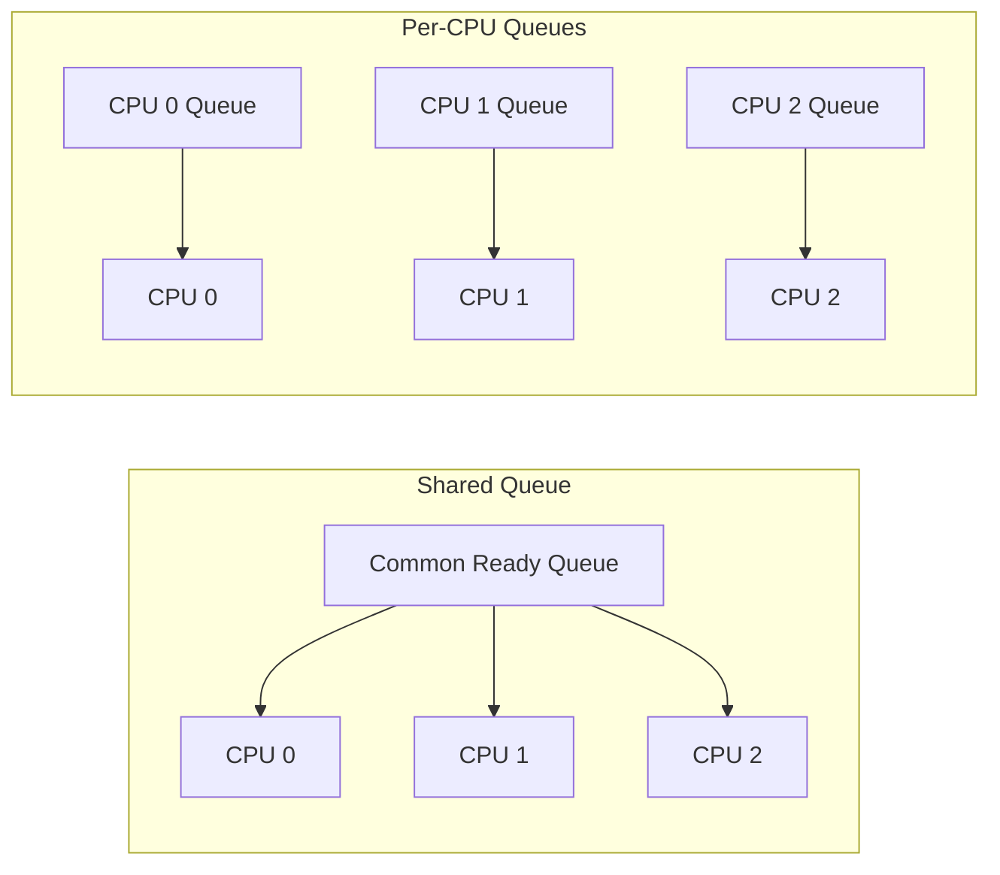
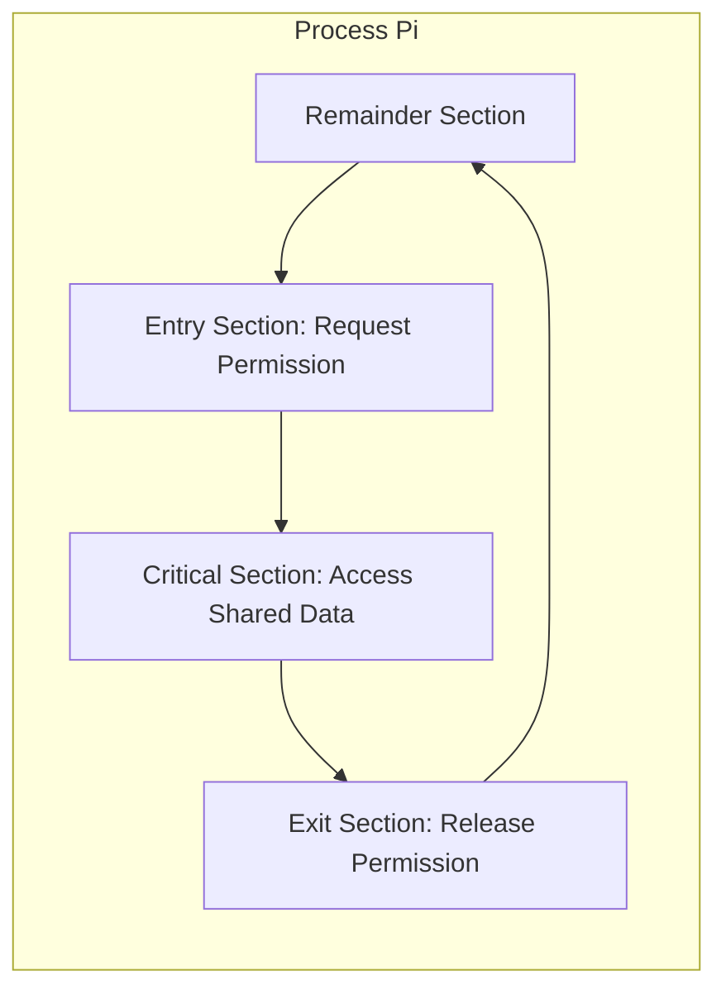

Welcome back! In **Lecture #09**, we mastered the basics of scheduling a *single* CPU. Now, in **Lecture #10**, we are stepping into the real world. 

Modern computers don’t have just one CPU—they have **multiple cores**, **hyper-threads**, and complex memory hierarchies. This lecture covers three massive pillars: 

1. **Multiprocessor Scheduling** (how to handle multiple CPUs). 
2. **Real-World OS Schedulers** (Linux, Windows, Solaris) & how we test them.
3. **The Introduction to Process Synchronization**—why having multiple processes access shared data is dangerous, and the basic tools (Mutex, Semaphores) to fix it.

Let’s decode this step-by-step.

---

# PART 1: Multiprocessor & Multicore Scheduling

## Topic: The Challenge of Multiple CPUs

### Simple Explanation
In a single-CPU system, the scheduler just picks the next process from one queue. In a multi-CPU system (like your quad-core laptop), the OS must decide **which process runs on which CPU core**. 

This is harder because:
- **Caches matter**: If a process moves from Core 1 to Core 2, the data it needs is no longer in Core 2’s cache (it’s "cold"), causing massive delays.
- **Balancing**: You don't want Core 0 overloaded while Core 3 sits idle.
- **Architectures**: Cores can share caches, or be on different physical chips (NUMA—Non-Uniform Memory Access).

---

### Why Do We Need It?
If we don't schedule intelligently across multiple cores, we waste the very hardware we paid extra for. Poor scheduling leads to **cache thrashing** (constantly moving data between caches) and **load imbalance** (one core at 100%, others at 10%).

---

### Real-Life Analogy
Imagine a **call center** with 5 customer service reps (cores). 
- **SMP (Shared Queue)**: All calls go into one giant bucket. Any free rep picks the next call. (Simple, but creates contention for the bucket).
- **Private Queue**: Each rep has their own pile of calls. If one rep finishes their pile, they sit idle while another is drowning. (You need load balancing to steal calls).

---

### How It Works: Key Concepts

#### 1. Architectures (Slide 2-6)
- **SMP (Symmetric Multiprocessing)**: All CPUs are equal. The OS schedules them symmetrically. 
- **Multicore CPUs**: Multiple cores on one physical chip (faster communication).
- **Chip-Multithreading (CMT) / Hyperthreading**: One physical core has 2 (or more) hardware threads. The OS sees these as **logical processors**. If one thread stalls on memory, the core switches to the other hardware thread instantly.
- **Heterogeneous multiprocessing**: CPUs in the system are not identical (e.g., a mix of high-power and low-power cores, like big.LITTLE architecture on smartphones). The OS must know which tasks are suitable for which type of core.


#### 2. Scheduling Approaches (Slide 3)
- **Common Ready Queue**: All threads go into one queue. Each processor picks the next thread. *Problem*: The queue becomes a bottleneck (needs locks).
- **Per-CPU Ready Queue**: Each processor has its own queue. *Problem*: Load imbalance.


#### 3. Load Balancing (Slide 8)
- **Push Migration**: A specific OS task runs periodically, checks CPU loads, and *pushes* a thread from an overloaded CPU to an idle one.
- **Pull Migration**: An idle CPU actively *pulls* a waiting task from a busy CPU's queue.

#### 4. Processor Affinity (Slide 9 - Extremely Important)
- **Soft Affinity**: The OS *tries* to keep a thread on the same CPU, but it might move it if necessary.
- **Hard Affinity**: The process tells the OS, *"I only want to run on these specific cores"* (e.g., Core 0 and 1 only).

**Why does affinity matter?** Because the cache is full of that process's data. If you move it, you lose the cache—this is called **cache miss**, and it hurts performance.

#### 5. NUMA (Slide 10)
- In NUMA systems, accessing RAM attached to your own CPU is fast. Accessing RAM attached to *another* CPU is slow. A NUMA-aware scheduler assigns memory close to the CPU running the thread.


---

### Visual Explanation (SMP Queues)


---

### Exam Focus
- **Difference**: Push vs Pull migration.
- **Conceptual**: Why is Hard Affinity useful for high-performance computing? (To keep the cache hot).
- **Definition**: NUMA.

---

# PART 2: Real-World OS Scheduling (Linux, Windows, Solaris) & Evaluation

## Topic: Linux Scheduling – O(1) and CFS

### Simple Explanation
Older Linux (pre-2.5) used a simple UNIX scheduler, but it struggled with multiple CPUs. They introduced the **O(1) Scheduler** (constant time scheduling) which used *active* and *expired* priority arrays. However, it had poor interactive performance.

Today, Linux uses the **Completely Fair Scheduler (CFS)**. Instead of fixed time quantums, CFS gives each process a **proportion** of CPU time. It tracks a value called `vruntime` (virtual runtime). The process with the *smallest* `vruntime` gets the CPU next—because it has "run the least" so far.

### Why Do We Need CFS?
CFS eliminates the rigid "time slice" concept. It dynamically adapts to the number of tasks. If there are 2 tasks, each gets ~50% CPU. If there are 100, each gets ~1%. It perfectly scales.

### Real-Life Analogy (CFS)
Think of a **teacher** trying to give attention to students. The teacher keeps a "fairness score" (`vruntime`). The student who has received the *least* attention gets called on next. If a student is naughty (low priority), their "attention count" decays slower—so they wait longer.

### How CFS Works (Slides 13-15)
1. **Scheduling Classes**: Linux has two scheduling classes—**default** (time-sharing) and **real-time**. The scheduler always picks the highest priority task from the highest scheduling class first.
2. **Priorities**: `nice` values range from -20 (highest priority) to +19 (lowest). 
3. **Target Latency**: The time interval in which every runnable task should get at least one turn on the CPU. 
4. **`vruntime`**: 
   - If a process has default priority (nice=0), `vruntime` = actual run time.
   - If a process has *higher* priority (nice < 0), its `vruntime` grows *slower*—so it stays on the left side of the tree and runs more often.
5. **The Data Structure**: CFS stores runnable processes in a **Red-Black Tree** (a balanced binary search tree). The key is `vruntime`. The **leftmost node** has the smallest `vruntime`—meaning it needs CPU the most. 
   - **Optimization**: Finding the leftmost node in a balanced tree usually takes \(O(\lg N)\) operations. However, for efficiency, Linux caches this value in a variable called `rb_leftmost`, making the decision **O(1)** in practice!
6. **O(1) Scheduler Details (Slide 12)**: The older O(1) scheduler used two priority arrays—`active` and `expired`. Tasks in the active array had time left in their time slice; once their time expired, they were moved to the expired array. When the active array was empty, the arrays were swapped. It worked well, but poor response times for interactive processes caused its demise.

**Topic: Linux Scheduling Domains (Slide 16)**
- Linux groups CPUs into **Scheduling Domains** based on what hardware resources they share (e.g., L2 cache, L3 cache, or an entire NUMA node).
- The primary goal is to keep threads from migrating between domains, because leaving a domain means losing cache locality.
- Load balancing is performed within these domains to avoid costly cross-domain migrations.
- *Diagram note*: Slide 16 shows `domain0` sharing an L2 cache, and `domain1` sharing another, while both share an L3 cache. Migrating within `domain0` is cheap; migrating to `domain1` is expensive.

---

### Visual (Red-Black Tree Logic)
```mermaid
graph TD
    Root[Root Node (vruntime=50)] --> Left[Left Node (vruntime=20)]
    Root --> Right[Right Node (vruntime=80)]
    Left --> LLeft[Leftmost (vruntime=5)]
    Left --> LRight[Node (vruntime=35)]
    style LLeft fill:#f9f,stroke:#333,stroke-width:4px
```
**Explanation**: The scheduler picks the pink node (vruntime=5) because it has run the least. After it runs, its `vruntime` increases, and the tree rebalances.

---

## Topic: Windows Scheduling

### Simple Explanation
Windows uses a **priority-based preemptive scheduler**. The thread with the highest priority always runs. It has a massive **32-level priority scheme** (0 to 31). 

- **Priority 0**: Reserved for the zero-page thread (memory management).
- **Priorities 1–15**: Variable class (dynamic—priorities can be boosted/lowered).
- **Priorities 16–31**: Real-time class (static—never lowered).

### How It Works (Slides 17-20)
1. **Process Priority Classes**: Processes have classes like `REALTIME`, `HIGH`, `NORMAL`, `IDLE`.
2. **Thread Relative Priorities**: Threads have relative levels like `TIME_CRITICAL`, `HIGHEST`, `NORMAL`, `LOWEST`, `IDLE`.
3. **The Matrix (Slide 19)**: Combining the class and relative priority gives the numeric priority. 
   - **Example**: `NORMAL_PRIORITY_CLASS` (base = 8) + `TIME_CRITICAL` (boost = 7) = Priority **15**. `REALTIME_PRIORITY_CLASS` + `TIME_CRITICAL` = Priority **31** (maximum).
4. **Priority Boosts**: 
   - If a thread is waiting for I/O (like a keyboard press), Windows boosts its priority so it responds immediately.
   - Foreground applications (the window you're looking at) get a **3x priority boost** to feel snappy.
5. **SMT Sets (Hyperthreading)**: Windows groups hardware threads that share the same physical core into "SMT sets" and tries to schedule threads across different cores first before using sibling threads on the same core.

---

### Industry Connection
- Windows uses this boost mechanism to make the UI feel responsive even when background CPU-heavy tasks (like virus scans) are running.

---

## Topic: Solaris Scheduling

### Simple Explanation
Solaris is highly configurable. It supports multiple scheduling classes:
- **TS (Time-Sharing)**: Default, dynamic priorities.
- **IA (Interactive)**: For GUI apps.
- **RT (Real-Time)**: Fixed priority.
- **FSS (Fair-Share)**: Guarantees CPU based on user/project allocations.

Solaris uses a **dispatch table** that maps priority to time quantum. Notice the inverse relationship: Higher priority → Smaller time quantum (so they get frequent, short bursts). Lower priority → Larger time quantum (they get long, infrequent bursts).

Here is the recreated **Solaris Dispatch Table** from slide 5.22, followed by a simple, easy-to-understand breakdown of how it works.

### Solaris Dispatch Table

| Priority | Time Quantum | Time Quantum Expired | Return from Sleep |
| --- | --- | --- | --- |
| 0 | 200 | 0 | 50 |
| 5 | 200 | 0 | 50 |
| 10 | 160 | 0 | 51 |
| 15 | 160 | 5 | 51 |
| 20 | 120 | 10 | 52 |
| 25 | 120 | 15 | 52 |
| 30 | 80 | 20 | 53 |
| 35 | 80 | 25 | 54 |
| 40 | 40 | 30 | 55 |
| 45 | 40 | 35 | 56 |
| 50 | 40 | 40 | 58 |
| 55 | 40 | 45 | 58 |
| 59 | 20 | 49 | 59 |

---

### Easy Explanation of the Table

This table is used by the Solaris operating system to dynamically manage processes that are sharing CPU time (called **Time-Sharing** and **Interactive** processes). It works like a reward-and-punishment system using a multilevel feedback queue to keep the computer running smoothly.

Here is what each column means in simple terms:

1. **Priority**
* **What it means:** The current importance level of a program's thread.
* **How it works:** In Solaris, a **higher number means a higher priority** (ranging from $0$ to $59$). Threads with higher priority numbers always get to run on the CPU before threads with lower numbers.


2. **Time Quantum**
* **What it means:** The maximum amount of time (usually in milliseconds) a thread is allowed to run on the CPU before it must step down.
* **How it works:** There is an **inverse relationship** between priority and time.
* Low-priority tasks (like level $0$) get a *large* time slice 200 ms because they don't get selected to run very often, so they are given more time when they finally do.
* High-priority tasks (like level $59$) get a *very short* time slice 20 ms so they don't hog the CPU and starve other programs.


3. **Time Quantum Expired**
* **What it means:** The new priority level assigned to a thread if it uses up its entire allocated time slice without stopping.
* **How it works (The Punishment):** If a thread takes up all of its allowed time, it is likely a heavy "CPU-bound" process (like rendering a video or doing heavy math). To prevent it from slowing down the system, the OS **lowers its priority**. For example, if a thread starts at priority $35$ and runs out of time, its priority is dropped down to $25$.


4. **Return from Sleep**
* **What it means:** The new priority level given to a thread when it wakes up after waiting for an event (like a user clicking a mouse, pressing a key, or loading a file from disk).
* **How it works (The Reward):** If a thread willingly stops running to wait for input/output, it is considered an "interactive" process. The OS **rewards it with a massive priority boost** when it wakes up so it can respond to the user immediately. For example, if a low-priority thread at level $5$ goes to sleep, when it returns, its priority jumps all the way up to $50$ to make the system feel fast and responsive.

---

## Topic: Evaluating Scheduling Algorithms (Slides 23-28)

How do we know which algorithm is best? We can't just guess. We use three methods:

1. **Deterministic Modeling** (Analytical) - Slides 23-24
   - Take a fixed workload (with exact burst times) and calculate the average waiting time for each algorithm.
   - *Pros*: Fast and simple.
   - *Cons*: Only applies to that specific input.


   **Worked Example (Slide 24)**:
   Processes: P1(10), P2(29), P3(3), P4(7), P5(12) arriving at time 0.
   - **FCFS**: P1(0-10), P2(10-39), P3(39-42), P4(42-49), P5(49-61). Average Wait = (0+10+39+42+49)/5 = 28ms.
   - **SJF**: P3(0-3), P4(3-10), P1(10-20), P5(20-32), P2(32-61). Average Wait = (0+3+10+20+32)/5 = 13ms.
   - **RR (q=10)**: P1(0-10), P2(10-20), P3(20-23), P4(23-30), P5(30-40), P2(40-49), P5(49-52). Calculate wait: P1(0), P2(10+10=20?), etc. The average comes out to 23ms. SJF wins for average wait time.

2. **Queueing Models** (Mathematical) - Slide 25
   - We model processes statistically (exponential distribution) and use formulas like **Little's Law**:
     - `n = λ × W` 
     - `n` = average number of processes in the queue.
     - `λ` = average arrival rate (processes per second).
     - `W` = average waiting time in the queue.
   - *Example*: If 7 processes arrive per second (`λ=7`), and 14 are in the queue (`n=14`), then `W = 14/7 = 2 seconds`.

3. **Simulations** (Most Accurate) - Slides 26-27
   - Write a program that mimics the OS and generates random events (CPU bursts, I/O) based on probability distributions. 
   - **Detail**: We gather data for the simulation via a **random number generator according to probabilities** (typically exponential distributions) that mirror real system behaviors.
   - Run the simulation to gather stats. 
   - *Limitation*: Still not perfectly accurate to real-world environments.


4. **Implementation** (Real Testing)
   - Put the new scheduler into a real OS and test it. High risk, but the only guarantee.
   - **Implementation caveat (Slide 28)**: Even real testing has limitations because environments vary. Most flexible schedulers can actually be **modified per-site or per-system**, or offer APIs to modify priorities. But again, the real-world environment varies wildly.

### Memory Trick
<Callout type="success">
Deterministic is Dead (fixed numbers), Queueing is Math, Simulation is Software, Implementation is Reality.
</Callout>

---

# PART 3: Introduction to Process Synchronization

## Topic: The Race Condition & Critical Section Problem

### Simple Explanation
Up until now, we assumed processes run independently. But what if two processes share data? For example, a **Producer** (creates data) and a **Consumer** (uses data) sharing a buffer. 

If we don't control their access, we get a **Race Condition**—where the final result depends on which process finishes its instructions *last*. This corrupts data.

---

**The Classic Producer-Consumer Code (Slides 33-34 vs Slide 35)**

Slide 33 & 34 show a **classic circular buffer solution using the `in` and `out` indices**:

- **Producer**: `while (((in + 1) % BUFFER_SIZE) == out) ; /* do nothing */` (Wait if buffer is full).
- **Consumer**: `while (in == out) ; /* do nothing */` (Wait if buffer is empty).

*Note on Slide 31:* The slide asks, "How to convert to an unbounded buffer?" The answer: Remove the `while (in + 1 == out)` condition so the producer never waits, allowing infinite growth. However, this is dangerous because it can consume all available memory.

Slide 35 introduces a **simpler approach using a `count` variable**:

- **Producer**: `while (count == BUFFER_SIZE) ; /* do nothing */`
- **Consumer**: `while (count == 0) ; /* do nothing */`

**Crucial difference**: Using `count` allows us to fully utilize the buffer up to `BUFFER_SIZE` items (instead of `BUFFER_SIZE-1` in the index-based method). However, as we'll see next, the `count++` and `count--` operations are not atomic, making this code vulnerable to race conditions.

---

### The Producer-Consumer Problem (Slides 35-36)
We have a shared `count` variable that tracks how many items are in the buffer.
- **Producer** does: `count++`
- **Consumer** does: `count--`

In machine code, `count++` is actually 3 operations:
1. Load `count` into a register (`LOAD`).
2. Increment the register (`ADD`).
3. Store it back to memory (`STORE`).

**The Race Scenario (Slide 36)**:
Imagine `count = 5` initially.
- Producer executes `LOAD` (gets 5), `ADD` (makes it 6), but **before it STORES** 6, the OS preempts it.
- Consumer runs `LOAD` (still sees the old value 5), `SUB` (makes it 4), `STORE` (count is now 4).
- Producer resumes, executes `STORE` (writes its calculated 6).
**Final result = 6** (instead of the correct 5). We lost the consumer's decrement!

---

### Why Do We Need Synchronization?
To prevent such data corruption. We need a protocol ensuring that if one process is updating a shared variable, no other process can touch it simultaneously.

---

### The Critical-Section Problem (Slides 37-39)
The section of code where shared data is accessed is called the **Critical Section**. 

We must design an entry/exit protocol around it that satisfies **3 Golden Rules**:
1. **Mutual Exclusion**: If Process A is in its critical section, Process B cannot be in its.
2. **Progress**: If no one is in the critical section, and some processes want to get in, the system must *quickly* pick one (no indefinite postponement).
3. **Bounded Waiting**: There must be a limit on how many times other processes can enter their critical sections while a process is waiting to get in (no starvation).

---

### The Tools: Mutex Locks & Semaphores (Slides 40-41)

**1. Mutex Locks (Binary)**
- Think of a **bathroom door lock**.
- `acquire()`: If the lock is free, take it. If not, wait (busy-wait).
- `release()`: Unlock it so others can use it.
- Code: `acquire(lock); // Critical Section ; release(lock);`
- *Limitation*: It only works for a single resource. It's just a boolean flag.

**2. Semaphores (Counting)**
- A Semaphore is an integer `S` that only changes via two atomic operations:
  - `wait(S)` (or `P`): If `S <= 0`, wait. Else, `S--`.
  - `signal(S)` (or `V`): `S++`.
- This can manage *multiple* resources (e.g., 5 printers available, `S=5`). If `S=1`, it acts like a mutex (called a Binary Semaphore).

**Exact Pseudocode from Slide 41**:
```c
wait(S) {
    while (S <= 0) ;  /* busy wait */
    S--;
}

signal(S) {
    S++;
}
```
*Note on Slide 41*: The `while (S <= 0);` is **busy-waiting**—the CPU spins in a loop wasting cycles. We will improve this later (using blocking queues), but conceptually, it's a valid solution.

---

### Visual (Critical Section Structure)


---

### Exam Focus
- **Definition**: Race Condition.
- **The 3 Requirements**: Mutual Exclusion, Progress, Bounded Waiting.
- **Difference**: Mutex (binary lock) vs Semaphore (counting integer).
- **Conceptual**: Why is `count++` not an atomic operation? (Because it compiles to multiple assembly instructions).

---

# Final Lecture Revision Sheet

## Must Remember Definitions (6)
1.  **Processor Affinity**: A thread's tendency to stick to one CPU to utilize cache.
2.  **NUMA**: Non-Uniform Memory Access—memory access time depends on the CPU location.
3.  **Push/Pull Migration**: Methods for load balancing across CPUs.
4.  **`vruntime`**: A virtual runtime counter used by CFS to decide fairness.
5.  **Race Condition**: Multiple processes manipulating shared data concurrently, resulting in corrupted data.
6.  **Critical Section**: The segment of code where shared variables are accessed.

## Most Important Concepts (6)
1.  **CFS (Linux)**: Uses Red-Black tree and `vruntime`. Lowest `vruntime` runs next.
2.  **Windows Priority**: 32 levels (0-31). Variable (1-15) and Real-time (16-31). Boosts foreground threads.
3.  **Evaluation Methods**: Deterministic, Queueing (Little's Law), Simulation, Implementation.
4.  **Multiprocessor Scheduling**: Load balancing must not ruin processor affinity.
5.  **Critical Section Requirements**: Mutual Exclusion, Progress, Bounded Waiting.
6.  **Semaphores**: `wait()` and `signal()` are atomic. `S` counts available resources.

## Common Exam Traps
- **Trap 1**: Don't confuse Hyperthreading (logical cores) with Physical cores. The OS sees logical cores.
- **Trap 2**: In CFS, a **lower** `nice` value (-20) means **higher** priority. Many students invert this.
- **Trap 3**: In the Producer-Consumer race condition, the corrupted result can be `4`, `5`, or `6`. The exam might ask you to trace the specific sequence yielding a specific number.
- **Trap 4**: Progress vs. Bounded Waiting. *Progress* is about the system choosing someone quickly. *Bounded Waiting* is about limiting how many times *others* cut in front of you.

## One-Page Revision Summary
- **Multi-CPU**: Use SMP. Keep caches warm via Affinity. Balance loads via Push/Pull. Hyperthreading provides logical processors.
- **Linux**: CFS rules! Red-black tree keyed by `vruntime`. Lower nice = faster `vruntime` growth.
- **Windows**: 32-level priority. Real-time beats Variable. Foreground boosts.
- **Evaluation**: Test via fixed workloads (Deterministic), Math (Queueing), Sim, or Live tests.
- **Synchronization**: Race conditions corrupt data. Critical Section needs Mutual Exclusion, Progress, Bounded Waiting. Implement via Mutex (lock) or Semaphore (counter).

## 5 Practice Questions (Without Answers)
1.  Explain the difference between "push migration" and "pull migration" in multiprocessor scheduling. Which is initiated by an idle processor?
2.  Describe the Linux CFS scheduler. How does it use `vruntime` and a Red-Black tree to select the next process to run?
3.  Assume `count = 10`. Trace a sequence of instructions where the Producer executes `count++` and the Consumer executes `count--` concurrently, resulting in a final `count` of `9`. Show the Register values.
4.  What is the difference between a Mutex lock and a Counting Semaphore? Give a practical example where a Semaphore (count > 1) is absolutely necessary.
5.  Compare and contrast deterministic modeling, queueing models, and simulations for evaluating CPU scheduling algorithms. Which is most accurate and why?