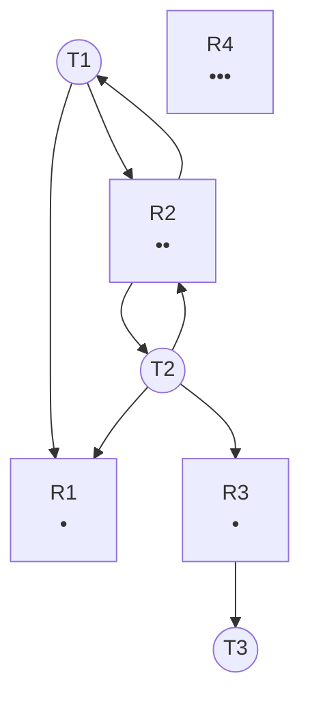
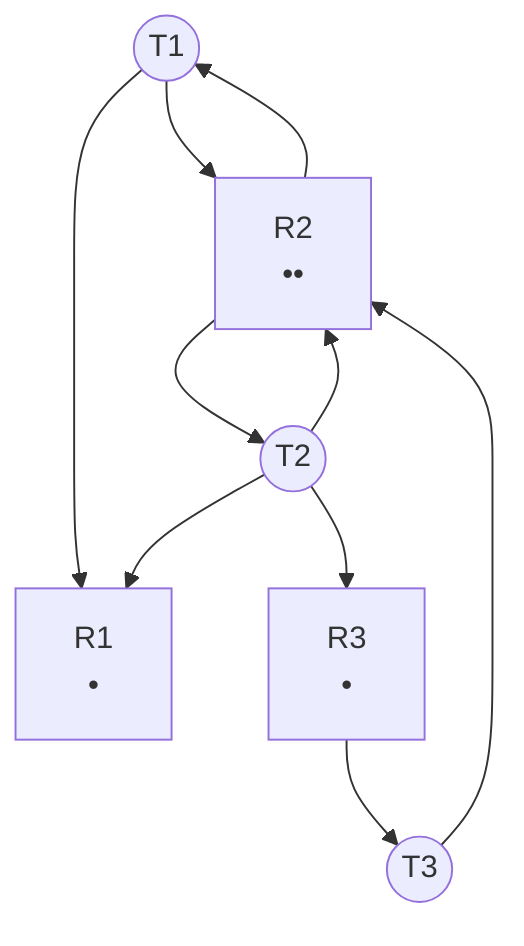
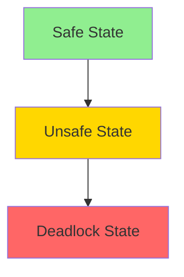
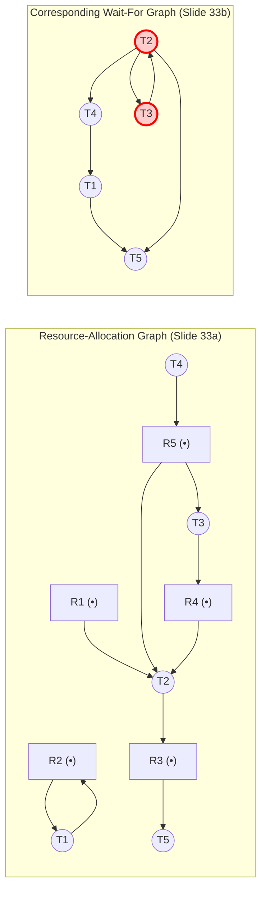

<Callout type="info">
Lecture 11 and 12 are identical as given in slides
</Callout>

## Topic 1: System Model & Deadlock Characterization

### Simple Explanation
A **deadlock** is a nightmare situation where a group of processes (or threads) are stuck waiting for each other forever. Imagine two cars at a 4-way intersection, each waiting for the other to move first—neither ever moves.

In an operating system, resources are things like **CPU cycles, memory space, printers, or I/O devices**. A thread must go through a lifecycle:
1. **Request** (ask for the resource)
2. **Use** (work with it)
3. **Release** (give it back when done)

If you study deadlocks, you learn how to prevent, avoid, detect, and recover from these traffic jams.

---

### Why Do We Need It?
Without deadlock handling, your computer could freeze completely. Critical servers (like banking databases) could lock up, leading to huge financial losses. We study this because OS designers must decide whether to "build guards" to prevent deadlocks, or "build ambulance services" to clean them up later.

---

### Real-Life Analogy
Imagine a **roundabout** with 4 cars entering from 4 directions. 
- **Condition 1:** Only one car can enter the roundabout at a time (Mutual Exclusion).
- **Condition 2:** A car holds its position in the lane while waiting for the car on its right to move (Hold and Wait).
- **Condition 3:** You cannot force a car to reverse out of the roundabout (No Preemption).
- **Condition 4:** Car A waits for B, B waits for C, C waits for D, and D waits for A (Circular Wait).
If all 4 happen, you have a deadlock.

---

### How It Works (4 Necessary Conditions - Slide 5)
Deadlock **only** happens if the following **four conditions hold simultaneously** (like a perfect storm). If you break just one, deadlock is impossible:

1. **Mutual Exclusion**: Only one thread can use the resource at a time.
2. **Hold and Wait**: A thread is holding at least one resource, but waiting to acquire more resources that are currently held by other threads.
3. **No Preemption**: Resources cannot be forcibly taken away. They can only be released voluntarily by the thread holding them after it finishes its task.
4. **Circular Wait**: There is a cycle of waiting threads. $T_0$ waits for a resource held by $T_1$; $T_1$ waits for $T_2$; ...; $T_{n-1}$ waits for $T_n$; and $T_n$ waits for $T_0$.

---

## Topic 2: Resource-Allocation Graph (RAG)

### Simple Explanation
To see deadlocks visually, we draw a **Resource-Allocation Graph (RAG)**. It is a roadmap showing who owns what and who is asking for what.

### Why Do We Need It?
Instead of reading text descriptions of 100 threads, we draw a picture. A single glance at the graph can tell us if a deadlock *might* exist.

### How It Works (Slide 6-10)
**The Drawing Rules:**
- **Vertices (Nodes):**
  - **$T$ (Threads/Processes)**: Drawn as **circles**.
  - **$R$ (Resources)**: Drawn as **rectangles**. Inside the rectangle, black dots represent the **number of instances** of that resource.
- **Edges (Arrows):**
  - **Request Edge ($T_i \to R_j$)**: An arrow from a Thread to a Resource box. *Meaning: "I want one of these!"*
  - **Assignment Edge ($R_j \to T_i$)**: An arrow from a Resource box to a Thread. *Meaning: "You are holding one of mine!"*

---

### Visual Explanation (Mermaid Diagrams)

Here are the **exact diagrams from Slides 7, 8, and 9** recreated in Mermaid.

**Diagram 1: Slide 7 (Simple RAG)**
*Note: Based on slide 7 description, $R_1$ has 1 dot, $R_2$ has 2 dots, $R_3$ has 1 dot, $R_4$ has 3 dots.*

*Explanation:* 
- $T_1$ holds an instance of $R_2$ and requests $R_1$.
- $T_2$ holds an instance of $R_2$ and requests $R_1$ and $R_3$.
- $T_3$ holds $R_3$.
- $R_4$ is completely unused. **There is no cycle here, so no deadlock.**

---

**Diagram 2: Slide 8 & 9 (Cycle But No Deadlock!)**
*This is a classic "trap" slide. Look closely at $R_2$—it has 2 dots (2 instances). Because $R_2$ has multiple instances, the cycle does NOT cause a deadlock.*

*Explanation:*
- $T_1$ holds one instance of $R_2$ and wants $R_1$.
- $T_2$ holds one instance of $R_2$ (second dot), and wants $R_1$ and $R_3$.
- $T_3$ holds $R_3$ and wants $R_2$.
- **The Critical Rule (Slide 10):** 
  - If graph contains **no cycles** = **NO DEADLOCK**.
  - If graph contains a **cycle**, and **only one instance per resource type** = **DEADLOCK**.
  - If graph contains a **cycle**, and **multiple instances exist** = **POSSIBILITY of deadlock**.
Here, $R_2$ has 2 instances. $T_3$ wants $R_2$, but there is still a free instance available! So $T_3$ can get $R_2$, complete its work, and release $R_3$. Therefore, **cycle exists, but no deadlock** (Slide 9).

---

### Exam Focus
- **Graph traversal**: Can you trace the arrow to find a cycle?
- **Difference question**: Single-instance cycle = deadlock. Multi-instance cycle = possibility, not guaranteed.

---

## Topic 3: Methods for Handling Deadlocks (Slide 11)

### Simple Explanation
The OS designer has 4 major choices to deal with deadlocks:
1. **Prevention**: Design the OS so that deadlocks are physically impossible.
2. **Avoidance**: Let threads ask for resources, but only grant them if we can mathematically prove it won't cause a deadlock later.
3. **Detection & Recovery**: Let deadlocks happen, but build a "deadlock police" to find them and force-break them.
4. **Ignore the problem**: Do nothing. Pretend deadlocks never happen (the "Ostrich Algorithm"). This is used in many real-world OSes because deadlocks are rare and fixing them is expensive.

---

## Topic 4: Deadlock Prevention (Slides 12-13)

### Simple Explanation
Prevention means **breaking one of the 4 conditions** so deadlock simply cannot happen.

### How It Works
1. **Break Mutual Exclusion**: 
   - *How*: Only use **sharable resources** (e.g., read-only files). 
   - *Problem*: Not all resources can be shared (e.g., a printer).
2. **Break Hold and Wait**: 
   - *How*: A thread must request **ALL** its resources at the very beginning before it executes. OR it requests resources only when it holds exactly 0 resources.
   - *Problem*: Very low resource utilization (threads sit idle holding unused resources) and **Starvation** (threads that wait too long never get everything they need).
3. **Break No Preemption**: 
   - *How*: If a thread requests a resource that is unavailable, the OS **forcibly preempts** all resources it currently holds. The thread is restarted later when it can get everything back.
4. **Break Circular Wait**: 
   - *How*: Impose a **total ordering** on all resource types. For example, `Resource A (ID=1)`, `Resource B (ID=2)`, `Resource C (ID=3)`. A thread must request resources in **strictly increasing order** (e.g., request A then C, but never C then A). This ensures a cycle can never form.

---

## Topic 5: Deadlock Avoidance & Safe State (Slides 14-18)

### Simple Explanation
Avoidance is smarter than prevention. It requires each thread to **declare its maximum resource needs upfront** (a priori information). The OS acts like a banker—it examines every request and says "Yes" only if granting it leaves the system in a **Safe State**.

### What is a Safe State? (Slide 15)
A system is in a safe state if there exists a **safe sequence** `[T1, T2, ..., Tn]` such that:
- For each thread $T_i$, the resources it still needs can be satisfied by:
  - Currently available resources **+**
  - Resources held by all threads that already finished before $T_i$ (i.e., $T_j$ where $j < i$).

**Crucial concept:** Safe State = **No deadlock**. Unsafe State = **Possibility of deadlock**. Avoidance ensures the system *never* enters an unsafe state.

---

### Visual Explanation (Safe, Unsafe, Deadlock - Slide 18)
Think of this as a 3-circle Venn diagram:

- If you are in the **Safe** area, you can move safely to the edge without hitting a deadlock.
- If you cross into the **Unsafe** area, you *might* still avoid deadlock, but it's incredibly risky.
- If you step into the **Deadlock** area, you are stuck forever.

---

## Topic 6: Deadlock Avoidance using the Banker's Algorithm (Slides 19-30)

### Simple Explanation
The **Banker's Algorithm** is used when there are **multiple instances** of a resource type (e.g., 5 printers). (If there is only 1 instance, we just check the Resource-Allocation Graph for cycles).

### How It Works - Data Structures (Slide 25)
- **$n$**: Number of threads. **$m$**: Number of resource types.
- **Available $[1..m]$**: How many of each resource are currently free.
- **Max $[1..n, 1..m]$**: The *maximum* resource needs each thread declared upfront.
- **Allocation $[1..n, 1..m]$**: How many resources each thread is currently holding.
- **Need $[1..n, 1..m]$**: How many more resources a thread needs to finish. 
  - **Formula**: $Need[i,j] = Max[i,j] - Allocation[i,j]$

---

### Worked Example (Slides 28-29 - Full Solved Example)
**Given**: 5 threads ($T_0$ to $T_4$), 3 resource types: **A (10 instances)**, **B (5 instances)**, **C (7 instances)**.
**Snapshot at time $T_0$**:

| Thread | Allocation (A,B,C) | Max (A,B,C) | Available (A,B,C) |
| --- | --- | --- | --- |
| $T_0$ | 0, 1, 0 | 7, 5, 3 | **3, 3, 2** |
| $T_1$ | 2, 0, 0 | 3, 2, 2 |  |
| $T_2$ | 3, 0, 2 | 9, 0, 2 |  |
| $T_3$ | 2, 1, 1 | 2, 2, 2 |  |
| $T_4$ | 0, 0, 2 | 4, 3, 3 |  |

**Step 1: Calculate the Need Matrix** (Max - Allocation)

| Thread | Need (A,B,C) |
| --- | --- |
| $T_0$ | 7, 4, 3 |
| $T_1$ | **1, 2, 2** |
| $T_2$ | 6, 0, 0 |
| $T_3$ | **0, 1, 1** |
| $T_4$ | **4, 3, 1** |

**Step 2: Run the Safety Algorithm to find a Safe Sequence (Slide 26)**

1. Initialize **Work = Available** = (3, 3, 2). **Finish** = [false, false, false, false, false].
2. Find a thread $T_i$ where `Finish[i] == false` AND `Need[i] <= Work`.
   - Check $T_1$: ``Need (1, 2, 2) <= Work (3, 3, 2)`` -> **YES!** 
   - Let $T_1$ run to completion. 
   - **Work = Work + Allocation$_{T1}$** = (3,3,2) + (2,0,0) = (5,3,2). Mark `Finish[1] = true`.
3. Look again:
   - Check $T_3$: ``Need (0,1,1) <= Work (5,3,2)`` -> **YES!**
   - Work = (5,3,2) + (2,1,1) = (7,4,3). `Finish[3] = true`.
4. Look again:
   - Check $T_4$: ``Need (4,3,1) <= Work (7,4,3)`` -> **YES!**
   - Work = (7,4,3) + (0,0,2) = (7,4,5). `Finish[4] = true`.
5. Look again:
   - Check $T_0$: ``Need (7,4,3) <= Work (7,4,5)`` -> **YES!**
   - Work = (7,4,5) + (0,1,0) = (7,5,5). `Finish[0] = true`.
6. Look again:
   - Check $T_2$: ``Need (6,0,0) <= Work (7,5,5)`` -> **YES!**
   - Work = (7,5,5) + (3,0,2) = (10,5,7). `Finish[2] = true`.

Since **all Finish[i] = true**, the system is in a **Safe State** and the safe sequence is **[$T_1$, $T_3$, $T_4$, $T_0$, $T_2$]**.

---

### Step 3: Resource-Request Algorithm (Slide 27 & 30) - Check 3 scenarios

**Scenario A: $T_1$ requests (1, 0, 2).**

1. Check ``Request <= Need``: ``(1,0,2) <= (1,2,2)`` -> **True**.
2. Check ``Request <= Available``: ``(1,0,2) <= (3,3,2)`` -> **True**.
3. Pretend to allocate:
   - Available = (3,3,2) - (1,0,2) = (2,3,0)
   - Allocation$_{T1}$ = (2,0,0) + (1,0,2) = (3,0,2)
   - Need$_{T1}$ = (1,2,2) - (1,0,2) = (0,2,0)
4. Run Safety Algorithm: Work = (2,3,0). 
   - $T_3$ Need (0,1,1) ``<=`` (2,3,0)? No (C needs 1, only 0 available). 
   - Re-run. $T_1$ ``Need (0,2,0) <= Work (2,3,0)`` -> Yes. Work = (2,3,0)+(3,0,2)=(5,3,2). 
   - Then $T_3$ -> $T_4$ -> $T_0$ -> $T_2$ all pass.
   - **Result**: Safe -> **GRANT request**.

**Scenario B: $T_4$ requests (3, 3, 0).**

- ``Request <= Available``: ``(3,3,0) <= (3,3,2)`` -> **True**.
- Pretend allocate: Available = (0,0,2).
- Run Safety: Work = (0,0,2). No process has ``Need <= (0,0,2)`` except maybe none (T0 needs 3 C). 
- **Result**: Unsafe -> **DO NOT GRANT. $T_4$ must wait.**

**Scenario C: $T_0$ requests (0, 2, 0).**

- ``Request <= Available``: ``(0,2,0) <= (3,3,2)`` -> **True**.
- Pretend allocate: Available = (3,1,2).
- Run Safety: Work = (3,1,2).
  - Check $T_1$ ``Need (1,2,2) <= (3,1,2)``? No (needs 2 B, only 1).
  - Check $T_3$ ``Need (0,1,1) <= (3,1,2)`` -> Yes. Work = (3,1,2)+(2,1,1)=(5,2,3).
  - Then $T_1$ passes, then $T_4$, then $T_0$, then $T_2$.
- **Result**: Safe -> **GRANT request**.

---

### Exam Focus
- **Common Trap**: Always run the Safety Algorithm *after* pretending to allocate. Never skip it!
- **Numerical Question**: You will be given a table and asked to find the Safe Sequence.

---

## Topic 7: Deadlock Detection (Slides 31-39)

### Simple Explanation
If the OS decides to *allow* deadlocks, it needs a way to detect them. The method depends on whether resources have **single instances** or **multiple instances**.

---

### Detection Method 1: Single Instance - Wait-For Graph (Slides 32-34)
**Simple Explanation:** 
Instead of drawing messy resource rectangles, we just draw a graph of **Threads** only. If Thread A is waiting for a resource held by Thread B, we draw an arrow $A \to B$. A cycle in this graph means **deadlock**.

**Visual Explanation (Slides 33 & 34):**
Let's convert the provided RAG into a Wait-For Graph:

*Explanation of Conversion:* 
- An assignment edge $R_5 \to T_2$ and a request edge $T_4 \to R_5$ means $T_4$ is waiting for $R_5$ held by $T_2$. Therefore, in the wait-for graph, we draw **$T_4 \to T_2$**.
- Looking at the graph, we see a clear cycle: **$T_2 \to T_3 \to T_2$**. This indicates a deadlock between T2 and T3. 
- **Complexity:** Detecting a cycle in a graph requires **$O(n^2)$** operations, where $n$ is the number of vertices.

---

### Detection Method 2: Multiple Instances (Slides 35-39)
**How It Works:**
Data structures used: `Available` (free resources), `Allocation` (resources held), `Request` (resources currently being asked for).

**Algorithm Steps:**
1. Initialize `Work = Available`.
2. Initialize `Finish[i] = true` if `Allocation[i] == 0` (thread has no resources, so it can't be holding anything up). Otherwise, `Finish[i] = false`.
3. Find index $i$ such that `Finish[i] == false` AND ``Request[i] <= Work``.
4. If found, do `Work = Work + Allocation[i]`, `Finish[i] = true`, and loop back to Step 3.
5. If no such $i$ exists, and some `Finish[i] == false`, those threads are **deadlocked**.

---

### Worked Example (Slide 38-39 - Detection Example)
**Given:** 5 threads, 3 resources A(7), B(2), C(6). Snapshot:
| Thread | Allocation (A,B,C) | Request (A,B,C) | Available (A,B,C) |
| --- | --- | --- | --- |
| $T_0$ | 0, 1, 0 | 0, 0, 0 | **0, 0, 0** |
| $T_1$ | 2, 0, 0 | 2, 0, 2 |  |
| $T_2$ | 3, 0, 3 | 0, 0, 0 |  |
| $T_3$ | 2, 1, 1 | 1, 0, 0 |  |
| $T_4$ | 0, 0, 2 | 0, 0, 2 |  |

**Step 1:** Work = (0,0,0). Finish = [false, false, false, false, false] (All have some allocations).
**Step 2:** Find `Finish[i]=false` AND ``Request[i] <= Work``:
- $T_0$ Request ``(0,0,0) <= (0,0,0)`` -> **YES!**
- Work = (0,0,0) + (0,1,0) = (0,1,0). Finish[0] = true.
**Step 3:** Continue loop:
- $T_2$ Request ``(0,0,0) <= (0,1,0)`` -> **YES!**
- Work = (0,1,0) + (3,0,3) = (3,1,3). Finish[2] = true.
- $T_3$ Request ``(1,0,0) <= (3,1,3)`` -> **YES!**
- Work = (3,1,3) + (2,1,1) = (5,2,4). Finish[3] = true.
- $T_4$ Request ``(0,0,2) <= (5,2,4)`` -> **YES!**
- Work = (5,2,4) + (0,0,2) = (5,2,6). Finish[4] = true.
- $T_1$ Request ``(2,0,2) <= (5,2,6)`` -> **YES!**
- Work = (5,2,6) + (2,0,0) = (7,2,6). Finish[1] = true.
**Result:** All Finish true. System is not deadlocked.

---

**Now, Slide 39 Modification:** $T_2$ requests an **additional instance of C**. So, Request matrix changes:
$T_2$ Request becomes (0,0,1).
Available remains (0,0,0).

**Run Algorithm again:**
Work = (0,0,0). Finish = [F,F,F,F,F].
- $T_0$ Request ``(0,0,0) <= (0,0,0)`` -> **YES!** Work = (0,1,0). Finish T0 = true.
- Now check the rest:
  - $T_2$ Request ``(0,0,1) <= Work (0,1,0)``? **NO (needs C=1, Work has C=0)**.
  - $T_3$ Request ``(1,0,0) <= Work (0,1,0)``? **NO (needs A=1)**.
  - $T_4$ Request ``(0,0,2) <= Work (0,1,0)``? **NO**.
  - $T_1$ Request ``(2,0,2) <= Work (0,1,0)``? **NO**.
No such `i` found. Finish is false for $T_1, T_2, T_3, T_4$.
**Result:** Deadlock exists! The deadlocked processes are **$T_1, T_2, T_3, T_4$**. Complexity of this algorithm is **$O(m \times n^2)$**.

---

## Topic 8: Recovery from Deadlock (Slides 40-42)

### Simple Explanation
Once detection finds a deadlock, how do we break it? The OS must act like a surgeon and terminate or rollback specific processes.

### How It Works (Recovery Choices)
**1. Abort a Process (Slide 41):** 
The OS must choose a victim to kill. Which one? Factors considered:
- Priority of the thread (kill low-priority).
- How long has it run, and how much longer to complete (kill the one closest to finishing? Or the farthest? Usually the one that is shortest to finish to minimize loss).
- Resources it is using (kill the one holding the most resources).
- Is it interactive or batch? (Never kill an interactive user process if avoidable).
- How many threads will need to be terminated to break the cycle.

**2. Rollback (Slide 42):**
- Instead of killing, the OS can **rollback** the process to a previous safe state (like a checkpoint in a video game), and restart it from there with the resources it needs.
- **Starvation Prevention:** The OS must be careful not to pick the *same* process as the victim every time. It includes "number of rollbacks" in the cost factor. If a process is rolled back too often, the OS chooses another victim.

---

# Final Lecture Revision Sheet

## Must Remember Definitions (6)
1.  **Deadlock**: A situation where a set of processes are blocked forever because each holds a resource needed by another.
2.  **Mutual Exclusion**: Only one process can use a resource at a time.
3.  **Hold and Wait**: A process holds one resource while waiting for another.
4.  **No Preemption**: Resources cannot be forcibly taken away from a process.
5.  **Circular Wait**: A cycle of processes, each waiting for a resource held by the next.
6.  **Safe State**: A state where there exists a safe sequence of process execution that guarantees no deadlock.
7.  **Banker's Algorithm**: A deadlock avoidance algorithm that uses `Available`, `Max`, `Allocation`, and `Need` matrices to simulate resource allocation.
8.  **Wait-For Graph**: A graph with only process nodes, used for deadlock detection in single-instance resource systems.

## Most Important Concepts (5)
1.  **The 4 Conditions**: Deadlock requires Mutual Exclusion, Hold and Wait, No Preemption, and Circular Wait. Break **any one** to prevent deadlock.
2.  **RAG Rules**: Cycle + single instance = DEADLOCK. Cycle + multiple instances = POSSIBILITY.
3.  **Banker's Algorithm**: Works by pretending to allocate, running the safety algorithm, and only granting if safe. Always check ``Request <= Available`` and ``Request <= Need``.
4.  **Detection Complexity**: Wait-for graph is $O(n^2)$. Multiple-resource detection is $O(m \times n^2)$.
5.  **Recovery Starvation**: Always track rollback counts to ensure the same process isn't repeatedly chosen as the victim.

## Common Exam Traps
- **Trap 1:** Thinking a cycle always equals deadlock. *Correction:* Only for single-instance resources.
- **Trap 2:** In Banker's, forgetting to revert the *pretend* allocation if the safety algorithm fails. *Correction:* You must restore the original matrices.
- **Trap 3:** In Detection Algorithm, forgetting that `Finish[i]` is initialized to `true` if `Allocation[i] == 0`. 
- **Trap 4:** Confusing Prevention vs. Avoidance. Prevention = breaking a rule structurally. Avoidance = checking dynamics on-the-fly.

## One-Page Revision Summary
- **Model**: Resources (Request, Use, Release).
- **Prevention**: Break Mutual Excl. (not always possible), Hold/Wait (starvation), No Preemption (release all), Circular Wait (ordering).
- **Avoidance (Banker's)**: Requires a priori max claims. Matrices: Available, Max, Allocation, Need ($Need = Max - Allocation$). Use Safety Algorithm to find safe sequence. Request algorithm: check ``Request <= Need`` & ``Available``, pretend allocate, check safety.
- **Detection**: Single Instances = Wait-For Graph ($O(n^2)$). Multiple Instances = Available, Allocation, Request algorithm ($O(m \times n^2)$).
- **Recovery**: Kill a victim (based on priority, time, resources) or Rollback to safe state. Prevent starvation by counting rollbacks.

## 5 Practice Questions (Without Answers)
1.  **Conceptual**: List the four necessary conditions for deadlock. Explain why breaking "Hold and Wait" leads to low resource utilization.
2.  **RAG**: Draw a Resource Allocation Graph with two threads ($T_1, T_2$) and two resources ($R_1$ with 1 instance, $R_2$ with 2 instances) such that there is a cycle in the graph, but the system is **NOT** in a deadlock state. Explain why.
3.  **Banker's Algorithm**: Given `Available = (3, 3, 2)`, and a thread $T_1$ with `Max = (3, 2, 2)` and `Allocation = (2, 0, 0)`, calculate its `Need`. If $T_1$ requests `(1, 0, 2)`, will the banker's algorithm grant the request? Show the safety check steps.
4.  **Detection**: In the deadlock detection algorithm for multiple resources, why is `Finish[i]` initialized to `true` when `Allocation[i]` is zero, but `false` otherwise? What would happen if you initialized all `Finish[i]` to `false`?
5.  **Recovery**: You are an OS designer. A deadlock is detected involving 3 processes: a real-time banking app, a background indexing tool, and a text editor. Based on the criteria provided, which process would you choose as the victim to rollback/abort, and why?
