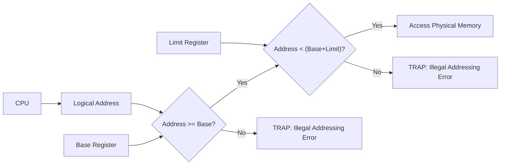
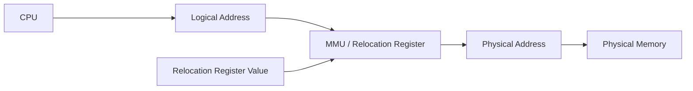
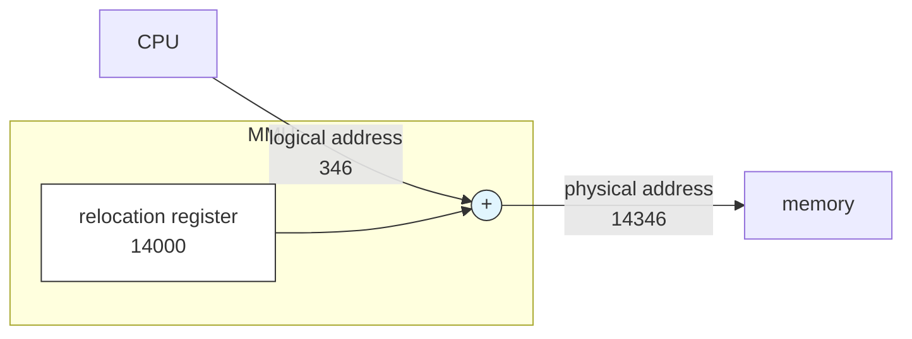
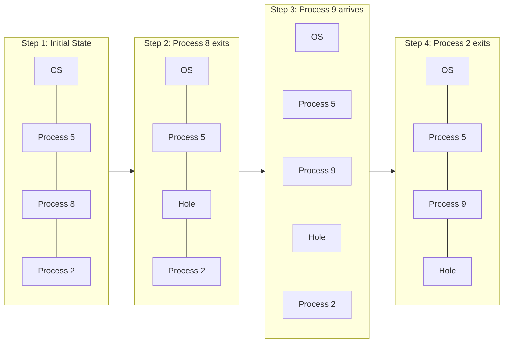
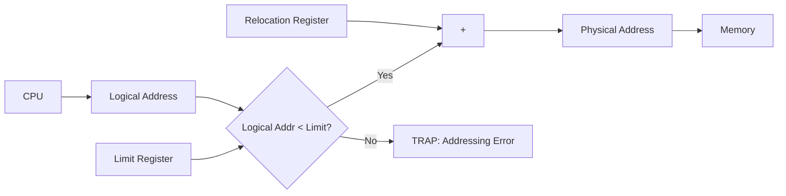
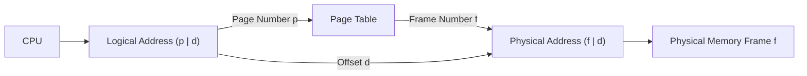
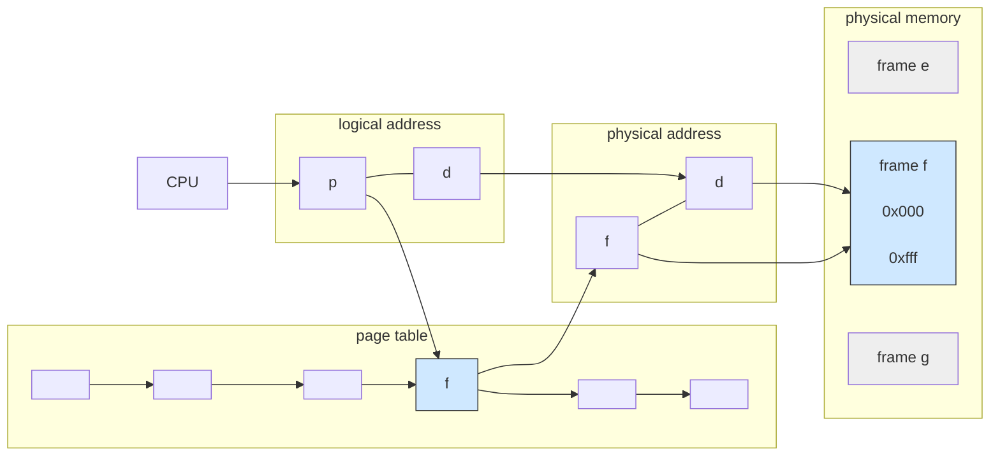

## Topic 1: Background & Memory Hierarchy (Slides 1-4)

### Simple Explanation
A computer's CPU is extremely fast, but it can only directly access data that is stored in **registers** (inside the CPU) or **main memory (RAM)**. Everything else—like your hard drive or SSD—is too slow for the CPU to touch directly. 

To run a program, the OS must bring it from the disk into main memory. But there is a speed gap:
- **Registers:** Access takes 1 CPU clock cycle (almost instant).
- **Main Memory (RAM):** Access can take many CPU cycles. If the CPU has to wait for RAM, it **stalls** (stops working).
- **Cache:** A smaller, faster memory placed *between* the CPU and Main Memory to reduce stalls.

### Why Do We Need It?
Without memory management, a process could overwrite the OS, crash the entire computer, or access another user's private data. The OS must protect memory and allocate it efficiently so multiple programs can run simultaneously without interfering with each other.

### Real-Life Analogy
Imagine a **library**.
- **Registers** = The book you are currently holding in your hand (instant access).
- **Cache** = The book resting on your reading desk (fast access).
- **Main Memory** = The bookshelf in your room (slower, but holds a lot).
- **Disk** = The huge warehouse across town (takes forever to get a book).
The **Memory Manager (OS)** is the librarian who ensures you only take books from your assigned shelf and don't steal the librarian's personal books.

---

## Topic 2: Memory Protection (Base & Limit Registers) (Slides 5-6)

### Simple Explanation
To stop a process from accessing memory outside its own area, the OS uses two special registers: the **Base register** and the **Limit register**. 
- The **Base register** holds the smallest physical address of the process (the starting point).
- The **Limit register** holds the *range* (size) of the process. 

Every time the CPU generates a logical address, the hardware checks:
1. Is the address `>=` the Base?
2. Is the address `<` Base + Limit?
If both are true, access is allowed. If not, the CPU generates a **trap** (illegal addressing error) and hands control back to the OS.

### Visual Explanation (Slide 6 – Hardware Check)
*Note: The instructions to load base/limit registers are privileged. Only the OS kernel can change them.*

---

## Topic 3: Address Binding & MMU (Slides 7-11)

### Simple Explanation
Programs are created in three stages: Source Code (symbolic), Compiled Code (relocatable addresses like "14 bytes from start"), and Linked/Loaded Code (absolute physical addresses). 

**Address binding** is the process of mapping these addresses to physical memory. It happens at 3 different times:
1. **Compile Time:** The absolute address is known at compile time. If the starting address changes, the program must be recompiled. (Very inflexible).
2. **Load Time:** The compiler generates relocatable code. The loader binds the address when it loads the program into memory. (Better, but the program cannot move after loading).
3. **Execution Time (Dynamic Binding):** The program is bound to physical addresses *as it runs*. This allows the program to move to a different location in memory during execution. (Most modern OSes use this).

**Key Definitions:**
- **Logical Address (Virtual Address):** The address generated by the CPU.
- **Physical Address:** The actual address seen by the memory unit.
- **MMU (Memory Management Unit):** The hardware device that maps logical addresses to physical addresses at run time.

### Visual Explanation (Slide 9 & 11 – MMU & Relocation Register)
In dynamic binding, we use a **Relocation Register** (which is just the Base Register during run time). The MMU automatically adds the value in the Relocation Register to every logical address produced by the user process before sending it to memory.

*Notice that the user program only ever deals with logical addresses—it has no idea where it physically sits in RAM.*

### What is happening here?

This diagram illustrates **dynamic address translation** using the **MMU (Memory Management Unit)** and a **relocation register**. 

**Step-by-step breakdown:**
1. **The CPU generates a logical address:** The CPU thinks the program is running at memory location `346`. This is the address seen by the user program (the **logical/virtual address**).
2. **The MMU intercepts the address:** Before the address reaches physical RAM, it passes through the MMU.
3. **The Relocation Register holds the base:** The OS has loaded this program into physical memory starting at address `14,000`. This value is stored in the **relocation register** inside the MMU.
4. **Addition occurs:** The MMU takes the logical address (`346`) and **adds** the relocation register value (`14,000`) to it.
   * \( 346 + 14,000 = 14,346 \)
5. **The physical address is sent to memory:** The resulting physical address (`14,346`) is sent to the physical memory to read or write the actual data.

**Why is this important?**
This mechanism allows the operating system to load a program into **any available block of physical memory**, completely without the program knowing it. The program deals only with its own logical addresses (starting at 0), while the OS uses the relocation register to map it to the actual physical hardware. This is the foundation of **dynamic binding** and enables key OS features like swapping and compaction.

---

## Topic 4: Dynamic Loading & Dynamic Linking (Slides 12-13)

### Simple Explanation
**Dynamic Loading:** Not all parts of a program are needed at startup. Rather than loading the entire giant program into RAM, the OS loads a routine *only when it is called*. If an exception is rarely used, it never wastes memory. This improves memory utilization.

**Dynamic Linking:** 
- **Static Linking:** The library code is physically copied and combined with your program's binary into one large file. 
- **Dynamic Linking:** The library is kept separately in memory. When your program is executed, a small piece of code called a **stub** runs. The stub locates the required library routine in memory (or loads it from disk if it's missing) and replaces itself with the routine's address. The routine then executes.

**Why use Dynamic Linking?** 
If 10 programs use the same library (e.g., `libc.so`), static linking would waste 10x memory. Dynamic linking keeps one copy in physical RAM for all programs to share. The OS checks if the routine is already in the process's address space; if not, it adds it.

---

## Topic 5: Contiguous Memory Allocation (Slides 14-17)

### Simple Explanation
In early computers, memory was divided into two main areas: 
1. **Operating System** (usually kept in low memory).
2. **User Processes** (held in high memory).

Each process was kept in a **single, continuous block** (partition) of memory. 
- **Fixed Partitioning:** Memory is divided into fixed-size chunks. (Problem: Internal fragmentation when a smaller process takes a huge chunk).
- **Variable Partitioning (Multiple-partition allocation):** Memory is divided into chunks sized exactly to fit the process's needs. The OS tracks which partitions are allocated and which are free (called **holes**).

### Visual Explanation (Slide 17 – Hole Merging)
When a process exits, it frees its partition. The OS checks if adjacent partitions are also free and merges them into one larger hole to accommodate bigger future programs.

<Callout type="success">
Variable partitioning dynamically allocates exact-fit memory to processes. When a process exits, it leaves a "hole"; the OS merges adjacent holes to create larger free blocks for incoming processes.
</Callout>

---

### Hardware Support (Slide 16 – Relocation with Limit)
To prevent one process from overwriting another, the hardware uses two registers:
- **Limit Register:** Checks `Logical Address < Limit`.
- **Relocation Register:** Adds the base physical address.

---

## Topic 6: Hole Allocation Algorithms (Slide 18)

### Simple Explanation
When a new process needs `n` bytes of memory, the OS must search the list of free holes to find a spot. There are 3 standard algorithms:

| Algorithm | How It Works | Best For |
| :--- | :--- | :--- |
| **First-Fit** | Allocate the *first* hole that is big enough. | Fastest; stops searching immediately. |
| **Best-Fit** | Search the entire list for the *smallest* hole that is big enough. | Leaves the smallest leftover hole. (Slow to search, but efficient). |
| **Worst-Fit** | Search the entire list for the *largest* hole. | Leaves the largest leftover hole (which can be reused for another process). |

**Exam Tip:** First-fit and Best-fit are generally better than Worst-fit in terms of speed and storage utilization.

---

## Topic 7: Fragmentation & Compaction (Slides 19-20)

### Simple Explanation
When we allocate memory dynamically, we encounter two types of waste:
1. **External Fragmentation:** Total free memory exists, but it is split into tiny, non-contiguous holes. You have 100MB total free, but the next process needs 50MB in one block, and the largest hole is only 40MB. *The memory exists, but it cannot be used.*
2. **Internal Fragmentation:** The allocated partition is slightly *larger* than the requested memory. For example, a process requests 100 bytes, but the system allocates 128 bytes. The extra 28 bytes are locked inside the partition but completely unused.

**The 50-percent Rule:** Research shows that given `N` allocated blocks, up to `0.5 * N` blocks will be lost to fragmentation—meaning roughly **1/3 of physical memory may be completely unusable**.

**Compaction (The Fix for External Fragmentation):**
- The OS **shuffles** all processes in memory to merge all holes into one big block of free memory at the top or bottom.
- **Problem:** Compaction is only possible if the OS supports dynamic relocation (binding at execution time). 
- **Major Issue:** If a process is actively doing **I/O** (reading/writing to a disk), moving its memory while the device is writing to it will corrupt the data! The OS handles this by either "latching" the process in memory during I/O, or doing all I/O through dedicated OS buffers.

---

## Topic 8: Paging Overview (Slides 21-22)

### Simple Explanation
To completely eliminate external fragmentation, modern OSes do not force processes into contiguous memory. Instead, they break memory down into tiny, fixed-sized blocks.
- **Physical memory** is divided into **frames** (e.g., 4 KB each).
- **Logical memory** is divided into **pages** (same size as frames).
- The OS keeps a **Page Table** that maps logical pages to physical frames. **The pages do not have to be contiguous in physical memory.**

### Why Do We Need It?
It solves external fragmentation entirely because *any* free frame can hold *any* page. A program's logical pages can be scattered across physical memory, and the Page Table translates the addresses transparently. *However, it still causes internal fragmentation* (the last page of a process is often partially empty).

### How Address Translation Works (Slide 22)
The logical address is split into two parts:
- **Page Number (p):** Index into the Page Table.
- **Page Offset (d):** The exact byte location within that page.
- If logical address space is `\(2^m\)` and page size is `\(2^n\)`, then:
  - `m-n` bits are used for the **Page Number**.
  - `n` bits are used for the **Offset**.

---

## Topic 9: Paging Hardware & Worked Example (Slides 23-25)

### Visual Explanation: Address Translation (Slide 23)

### Worked Example (Slide 24 & 25 – Mapping Pages to Frames)

**Given:**
- Logical Memory size = 16 bytes.
- Page size = 4 bytes.
- Physical Memory size = 32 bytes (8 frames).

From this data:
- Page size `4 = 2^2` → Offset uses **2 bits**.
- Total logical memory `16 = 2^4` → Page number uses `4 - 2 = **2 bits**`.

**The mapping from the slide:**
| Logical Page | Frame Number |
| :--- | :--- |
| 0 | 5 |
| 1 | 6 |
| 2 | 1 |
| 3 | 2 |

**Step-by-step interpretation:**
- If the CPU generates logical address `8` (which is page 2, offset 0), the CPU sends `p=2` to the Page Table.
- The Page Table says page 2 is in physical **frame 1**.
- The MMU forms the physical address as Frame 1, Offset 0.
- Frame 1 starts at physical memory location `4 * 1 = 4`. So physical address = `4 + 0 = 4`.

*Slide 25 explicitly maps the alphabet array:* 
`logical 0-3 (a-d) -> frame 5 (physical 20-23)`
`logical 4-7 (e-h) -> frame 6 (physical 24-27)`
`logical 8-11 (i-l) -> frame 1 (physical 4-7)`
`logical 12-15 (m-p) -> frame 2 (physical 8-11)`

---

## Topic 10: Internal Fragmentation in Paging & Free Frames (Slides 26-27)

### Simple Explanation
Even with paging, we still have internal fragmentation. The last page of a process rarely fills up completely.

### Worked Example (Slide 26 - Fragmentation Calculation)
**Given:**
- Page size = 2,048 bytes.
- Process size = 72,766 bytes.

**Calculations:**
1. Total required pages = `72,766 / 2,048 = 35.53`.
2. That is `35 full pages` (35 * 2048 = 71,680 bytes) + `1,086 bytes` (remaining).
3. Since memory is allocated in whole pages, the OS allocates `36 pages`.
4. The wasted space is `2,048 (page size) - 1,086 (last page content) = **962 bytes** of internal fragmentation.
5. The **worst case fragmentation** = 1 frame - 1 byte. The **average** fragmentation = 1/2 a frame size.

**So, should we use tiny page sizes to reduce waste?**
- Small pages = less fragmentation.
- But, the Page Table must track *every single page*. Tiny pages mean a gigantic page table that consumes massive amounts of memory! (Solaris uses hybrid sizes: 8 KB and 4 MB pages to balance this).

### Visual Explanation: Free Frame Allocation (Slide 27)
When a new process arrives, the OS maintains a list of free frames.

**Before Allocation:** Free list = `[14, 13, 18, 20, 15]` (Various scattered frames are free).
**After Allocation:** The OS sees the process needs 4 pages.
- Frame 14 → Page 0
- Frame 13 → Page 1
- Frame 18 → Page 2
- Frame 20 → Page 3
The Page Table for this process is: `[0->14, 1->13, 2->18, 3->20]`.
The remaining free frame is `15`. **No external fragmentation** was created.

---

# Final Lecture Revision Sheet

## Must Remember Definitions (8)
1. **Logical Address (Virtual Address):** Address generated by the CPU.
2. **Physical Address:** Actual address seen by the memory unit.
3. **Base Register:** Holds the smallest physical address of a process.
4. **Limit Register:** Holds the range (size) of a process; ensures the process doesn't access memory beyond its limit.
5. **MMU (Memory Management Unit):** Hardware that maps logical to physical addresses at runtime.
6. **External Fragmentation:** Total free memory exists, but is split into non-contiguous holes.
7. **Internal Fragmentation:** Wasted memory internal to a partition/frame because the allocated block is larger than the requested block.
8. **Paging:** A memory management scheme allowing non-contiguous physical memory allocation by breaking logical memory into pages and physical memory into frames.

## Most Important Concepts (5)
1. **Binding Times:** Compile time, Load time, Execution time. Only Execution time allows relocation/compaction.
2. **Fragmentation Solutions:** External fragmentation is solved by Paging. Internal fragmentation occurs in Paging (because of partially filled frames).
3. **Hole Allocation Algorithms:** First-fit (fastest), Best-fit (smallest leftover), Worst-fit (largest leftover). First-fit and Best-fit are better.
4. **Page Table Translation:** Split logical address into `Page Number (p)` + `Offset (d)`. `p` is an index into the table to find the Frame. `d` remains unchanged.
5. **Compaction Limitations:** Requires execution-time binding and cannot be done when a process is involved in I/O.

## Common Exam Traps
- **Trap 1:** Thinking dynamic linking means the entire library is copied into the program. *Correction:* Dynamic linking uses a *stub* to locate the library at runtime; static linking is what copies the library into the binary.
- **Trap 2:** Confusing `Base` and `Relocation` registers. *Correction:* Base is the start address. Relocation adds the base to every logical address at execution time.
- **Trap 3:** Assuming Paging eliminates *all* fragmentation. *Correction:* It eliminates *External* fragmentation, but internal fragmentation (in the last page) remains.
- **Trap 4:** Forgetting that Best-Fit produces the smallest leftover hole. (Many students assume it produces the largest).

## One-Page Revision Summary
- **Memory Protection:** Base/Limit registers check logical addresses (`Base <= Logical < Base+Limit`).
- **Address Binding:** Compile (static), Load (fixed), Execution (dynamic) – dynamic allows swapping and compaction.
- **Contiguous Allocation:** Variable partitions leave holes. Algorithms: First-Fit, Best-Fit, Worst-Fit. Problems: External Fragmentation, Internal Fragmentation.
- **Compaction:** Shuffles memory to merge holes. Requires dynamic binding. I/O prevents compaction.
- **Paging:** Physical memory = frames. Logical memory = pages. Page Table maps `p` to `f`. Offset `d` stays the same. Solves external fragmentation, creates internal fragmentation (last page).
- **Fragmentation Math:** Worst case = frame - 1 byte. Average = half a frame.

## 5 Practice Questions (Without Answers)
1. **Conceptual:** Compare and contrast static linking and dynamic linking. Why is dynamic linking preferred for system libraries?
2. **Calculation:** A process has a size of 44,000 bytes. The page size is 4,096 bytes. How many pages are allocated? How much internal fragmentation occurs?
3. **Algorithm:** You have the following list of holes in memory: `[120KB, 60KB, 240KB, 100KB]`. A process requests 100KB of memory. Show which hole is selected by First-Fit, Best-Fit, and Worst-Fit. Which algorithm leaves the smallest leftover hole?
4. **Hardware:** Draw a simple flowchart showing how the CPU, Base register, Limit register, and MMU interact when a user process generates a logical address of `500`, given `Base = 1000` and `Limit = 300`.
5. **Paging:** A logical address is 16 bits. The page size is 4 KB (\(2^{12}\)). How many bits are used for the page number, and how many for the offset? If page `0x02` maps to physical frame `0x05`, and the offset is `0x03`, what is the physical address? (Assume frame size = page size).