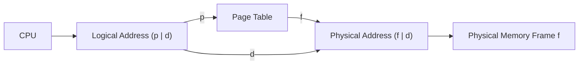
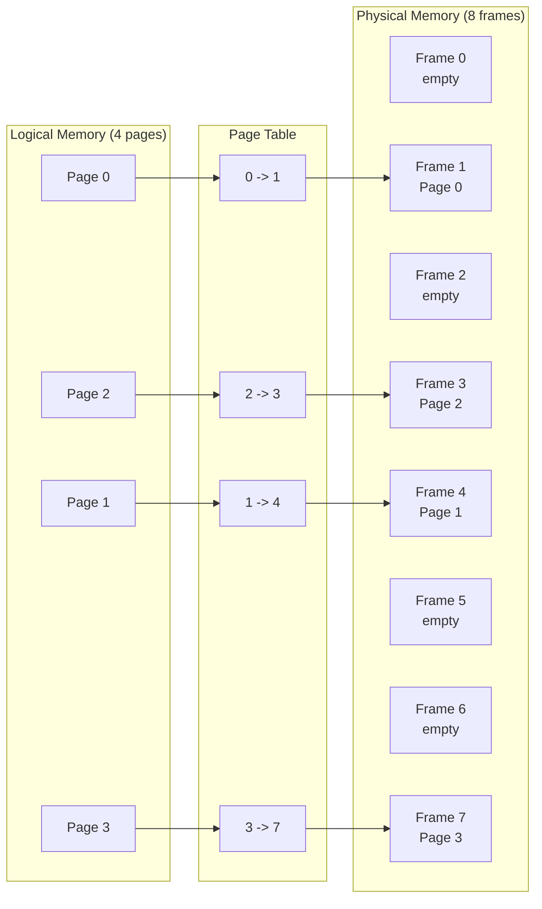
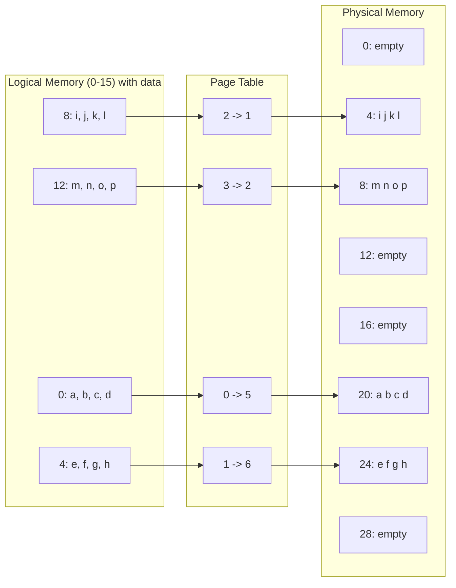
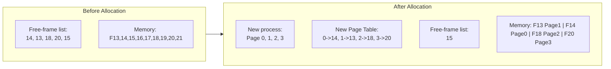
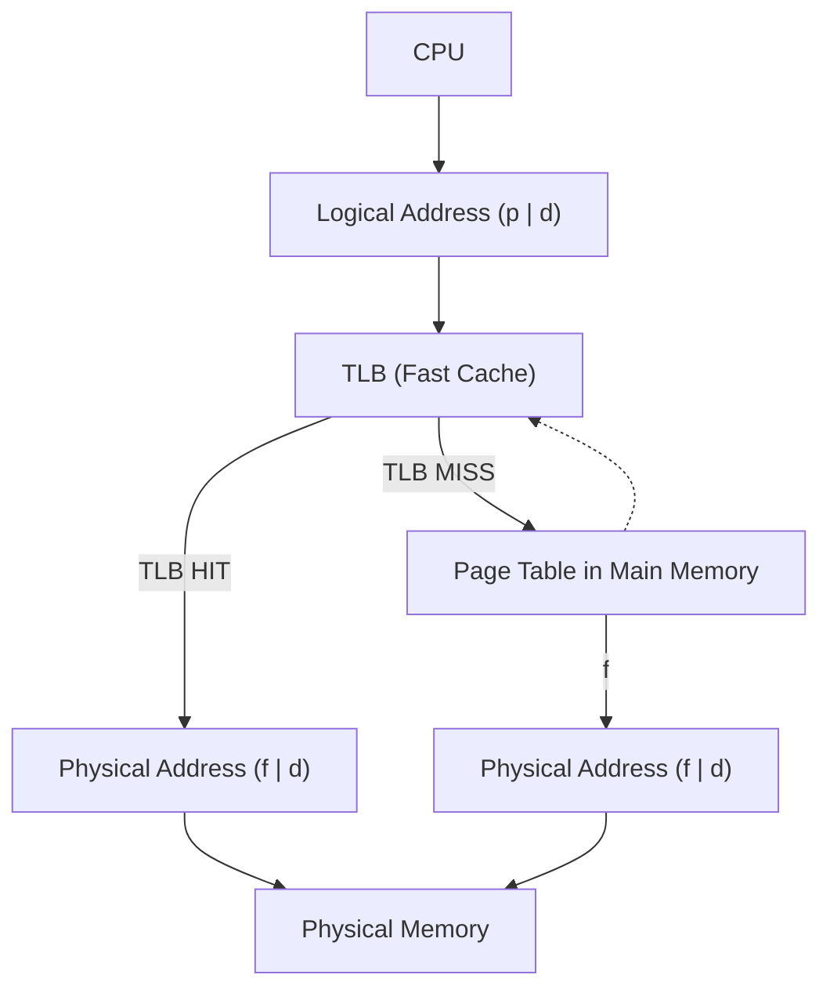
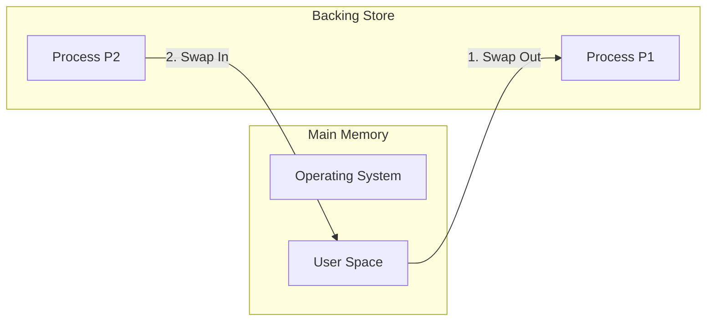
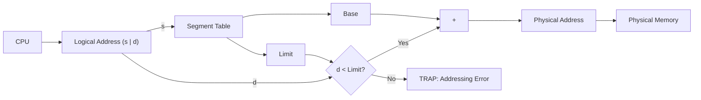
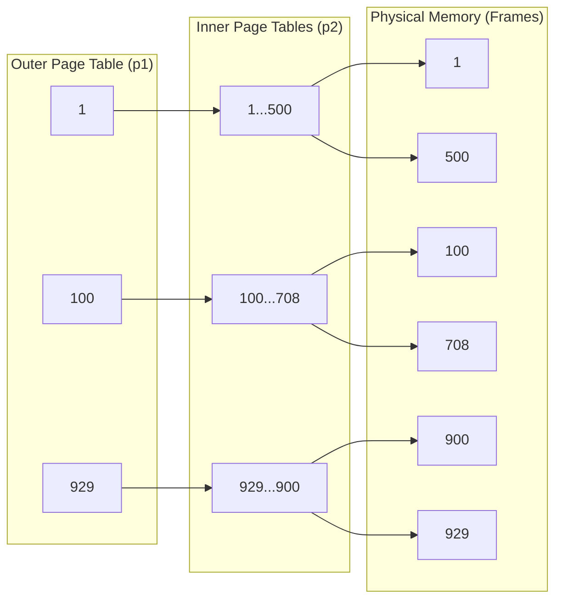
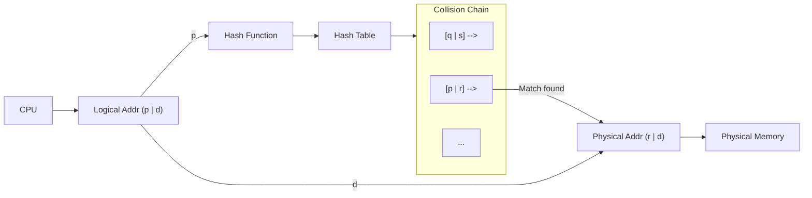
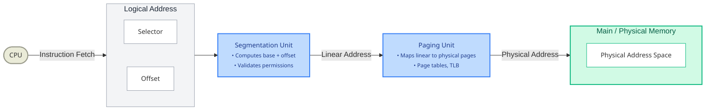

## Topic 1: Paging Hardware & Page Table Translation (Slides 4-6)

### Simple Explanation
Now that we know paging breaks memory into pages and frames, let's look at how the hardware actually translates a logical address to a physical one. The CPU generates a logical address, splits it into a **Page Number (p)** and an **Offset (d)**. 
The **Page Number** acts as an index into the **Page Table**. The Page Table entry holds the **Frame Number (f)**. The MMU simply replaces `p` with `f` to form the physical address, while `d` (the offset) remains completely unchanged.

### Diagram 1: Paging Hardware (Slide 4)

**Explanation:** The page number `p` is sent to the page table. The page table returns the frame number `f`. The MMU constructs the physical address by using `f` and appending the unchanged offset `d`.

### Diagram 2: Simple Page Mapping (Slide 5)

**Explanation:** The logical pages (0, 1, 2, 3) are mapped to physical frames (1, 4, 3, 7) arbitrarily by the OS. They do not need to be contiguous.

### Diagram 3: Paging Example with Data (Slide 6)
*This example explicitly maps the alphabet characters (a-p) across scattered physical frames.*

**Note:** Internal fragmentation calculation (Slide 7) was covered in Lecture 13. The numbers here are: Process size 72,766 bytes, Page size 2,048 bytes. 35 full pages + 1,086 leftover bytes. 36th page allocated. Internal fragmentation = `2,048 - 1,086 = 962 bytes`.

---

## Topic 2: Implementing the Page Table & PTBR (Slides 8-9)

### Simple Explanation
Page tables are stored in main memory. The OS uses two special hardware registers:
1. **Page-Table Base Register (PTBR):** Holds the starting physical address of the current process's page table.
2. **Page-Table Length Register (PTLR):** Holds the total size of the page table (to prevent the CPU from reading beyond the process's map).

**The Two-Memory-Access Problem:** Because the page table itself lives in RAM, every single data/instruction access now requires **two memory reads**:
1. Read the page table from memory (to get the frame number).
2. Read the actual data/instruction from physical memory (using the newly formed physical address).

### Diagram 4: Before & After Free-Frame Allocation (Slide 8)

**Explanation:** The OS takes the first 4 available frames (14, 13, 18, 20) to load the new process. The free list now only contains `15`.

---

## Topic 3: Translation Look-Aside Buffer (TLB) (Slides 10-13)

### Simple Explanation
To solve the "two-memory-access" problem, the MMU is equipped with a specialized, super-fast hardware cache called the **Translation Look-Aside Buffer (TLB)**. 
The TLB stores recently used `(Page Number, Frame Number)` pairs. It works like an associative memory:
- **TLB Hit:** The page number is found in the TLB. The frame number is fetched in **1 CPU cycle**. Memory access is fast!
- **TLB Miss:** The page number is *not* in the TLB. The MMU must go to main memory to read the page table (2 memory accesses). The OS then updates the TLB with this new mapping for future references.

**Effective Access Time (EAT) Calculation (Slide 13):**
- Memory access time = 10 ns.
- If `80%` hit ratio:
  `EAT = 0.80 × 10 + 0.20 × 20 = 12 ns` (20% slowdown).
- If `99%` hit ratio:
  `EAT = 0.99 × 10 + 0.01 × 20 = 10.1 ns` (only 1% slowdown).

**ASIDs (Slide 10):** To avoid clearing the TLB on every context switch, modern TLBs store **Address-Space Identifiers (ASIDs)**. This uniquely identifies which process owns each TLB entry, providing built-in memory protection.

### Diagram 5: TLB Hit vs TLB Miss Flow (Slide 12)

**Explanation:** The TLB is checked first. If the mapping is found (Hit), the address is sent immediately. If not (Miss), the page table is queried, and the TLB is updated.

---

## Topic 4: Memory Protection & Shared Pages (Slides 14-17)

### Simple Explanation
How do we protect memory in a paged system? The OS associates a **Valid-Invalid bit** and **Protection bits** with each page table entry:
- **Valid bit:** `1` means the page is in the process's logical address space. `0` means the page is out of bounds (causes a trap to the OS).
- **Protection bits:** Indicate if a page is read-only, read-write, or execute-only.

**Shared Pages:** If multiple processes are running the same program (like a text editor or a C library `libc`), the OS can map their page tables to the **same physical frames**. This saves a massive amount of physical RAM. The shared code must be **reentrant (read-only)** to prevent one process from overwriting another's code.

### Diagram 6: Shared Pages (Slide 17)

**Explanation:** Both Process P1 and P2 have page tables mapping their logical `libc` sections to the exact same physical frames (3, 4, 6, 1). Only one copy of the library exists in memory.

---

## Topic 5: Swapping (Slides 18-23)

### Simple Explanation
When physical memory is full, the OS can **swap** a process out of main memory to a fast disk (called the **backing store**) and swap another process in from disk to run. This allows the total physical memory space of all processes to exceed the available RAM.

- **Roll out, Roll in:** Used in priority-based scheduling. A low-priority process is swapped out to load a high-priority process.
- **Context Switch Time:** Swapping is extremely slow. If you swap a 100MB process to a 50MB/sec disk, it takes 2000ms to swap out, and 2000ms to swap in = **4 seconds** of pure I/O overhead.

**Mobile Swapping (Slide 22):** iOS and Android rarely use full swapping due to limited flash memory write cycles.
- **iOS:** Asks apps to voluntarily free memory. If they don't, they are terminated.
- **Android:** Terminates apps but saves their state to flash so they can be quickly restarted.

### Diagram 7: Schematic View of Swapping (Slide 20)

### Diagram 8: Swapping with Paging (Slide 23)
*With paging, the OS doesn't need to swap an entire process at once. It can swap individual pages in and out.*

**Explanation:** The shaded blocks represent pages that have been swapped out to the backing store. The OS only brings them back into main memory when they are needed.

---

## Topic 6: Segmentation (Slides 24-29)

### Simple Explanation
Paging divides memory mechanically (equally sized blocks). **Segmentation** divides memory logically. A program is naturally composed of logical units: main program, procedures, functions, local variables, global variables, stack, array, etc.

**Segmentation Hardware:**
The logical address is a pair `[Segment Number (s), Offset (d)]`.
- **Segment Table:** Maps segment numbers to physical memory.
  - **Base:** The starting physical address of the segment.
  - **Limit:** The length of the segment.
- **STBR (Segment-Table Base Register):** Points to the segment table.
- **STLR (Segment-Table Length Register):** Ensures the segment number `s` is legal (`s < STLR`).

**Protection:** Each segment entry has a validation bit and read/write/execute privileges. Since segments vary in length, memory allocation is dynamic and suffers from **External Fragmentation** (which is why paging is often preferred over pure segmentation).

### Diagram 9: Segmentation Hardware (Slide 29)

**Explanation:** The CPU sends `s` to the Segment Table. The table returns the `Limit` and `Base`. The MMU checks if the offset `d` is within the `Limit`. If yes, it adds `d` to the `Base` to produce the physical address.

---

## Topic 7: Advanced Page Table Structures (Slides 30-39)

### Simple Explanation
A flat page table for a 32-bit machine with 4KB pages (2^12) has `2^32 / 2^12 = 2^20 = 1 million entries`. If each entry is 4 bytes, the page table takes **4 MB of physical memory**—and that's just for ONE process! Worse, for 64-bit machines, a flat table is impossibly huge. 

To solve this, we use smarter structures:

**1. Hierarchical (Two-Level) Paging (Slides 31-33)**
- We page the page table itself! We create an **Outer Page Table (p1)** and **Inner Page Tables (p2)**.
- For a 32-bit system with 4KB pages (12-bit offset): 
  - Page number = 20 bits. 
  - We split the 20 bits into `10 bits (p1)` + `10 bits (p2)`.
  - p1 indexes into the **Outer Page Table**. The outer entry points to an **Inner Page Table**.
  - p2 indexes into the **Inner Page Table**.
  - The inner entry finally gives us the physical frame number.

**2. Hashed Page Tables (Slide 36-37)**
- Common for 64-bit systems. The virtual page number is passed through a **hash function**.

- The hash table contains a *chain* of elements. Each element holds:
  1. The virtual page number.
  2. The mapped physical frame number.
  3. A pointer to the next element in the chain.
- If the virtual page matches an element in the chain, the physical frame is extracted.

**3. Inverted Page Tables (Slides 38-39)**

- Instead of having a page table per process (huge), we have **one single inverted page table** for the *entire physical memory*.
- There is one entry for each physical frame in the system.
- The entry stores: `(Process ID, Virtual Page Number)` of the process currently occupying that frame.
- *Pros:* Drastically reduces memory used for page tables.
- *Cons:* Slower to search. To find a page, the OS must search the entire table. It usually uses a hash table to accelerate the search.

### Diagram 10: Two-Level Paging (Slide 31)

### Diagram 11: Hashed Page Table (Slide 37)

**Explanation:** The hash function turns `p` into a hash table index. The index points to a linked list. The OS traverses the list until it finds the entry that contains `p`. It then extracts the frame `r` to form the physical address.

---

## Topic 8: Example: Intel IA-32 Architecture (Slides 40-43)

### Simple Explanation
Intel’s 32-bit architecture (IA-32) uses **segmentation with paging**.
1. **Logical Address (Selector + Offset):**
   - The CPU generates a **Selector** (16 bits) and **Offset**.
   - The Selector consists of: `s (Segment #)`, `g (GDT/LDT flag)`, `p (Protection)`.
2. **Segmentation Unit:**
   - The Segmentation Unit uses the selector to look up the segment in the **GDT (Global Descriptor Table)** or **LDT (Local Descriptor Table)**.
   - It combines the segment's base address with the offset to produce a **Linear Address**.
3. **Paging Unit:**
   - The Paging Unit takes the **Linear Address** and uses a paging mechanism (like two-level paging) to translate it into the final **Physical Address**.
   - Pages can be 4 KB or 4 MB.

---

# Final Lecture Revision Sheet

## Must Remember Definitions (7)
1.  **PTBR (Page-Table Base Register):** Points to the start of the current process's page table.
2.  **TLB (Translation Look-Aside Buffer):** A fast hardware cache that holds recent page-to-frame mappings to reduce memory access time.
3.  **ASID (Address-Space Identifier):** Uniquely identifies a process within the TLB to prevent cache flushes on context switches.
4.  **Valid-Invalid Bit:** A bit in a page table entry that indicates whether a page is currently in the process's logical address space (valid) or not (invalid).
5.  **Reentrant Code:** Read-only shared code that multiple processes can execute simultaneously without corrupting each other's state.
6.  **Backing Store:** A fast disk used to hold swapped-out processes or pages.
7.  **Inverted Page Table:** A single global page table with one entry per physical frame, storing `(Process ID, Virtual Page)` to reduce memory overhead.

## Most Important Concepts (5)
1.  **TLB Translation & EAT:** A TLB Hit = 1 memory access. TLB Miss = 2 memory accesses. EAT = `(Hit% × 1) + (Miss% × 2)`.
2.  **Shared Pages:** Allows multiple processes' page tables to map to the same physical frames, saving massive memory for libraries and text editors (provided the code is read-only).
3.  **Swapping:** Swapping entire processes is slow (calculated in seconds). Swapping with paging allows the OS to swap individual pages instead of whole processes.
4.  **Segmentation vs Paging:** Segmentation divides memory *logically* (by code/function/stack), causing *external* fragmentation. Paging divides memory *mechanically* (fixed blocks), causing *internal* fragmentation.
5.  **Hierarchical Paging:** To avoid a 4MB page table for a 32-bit process, we page the page table using an outer and inner level (p1, p2).

## Common Exam Traps
- **Trap 1:** Thinking a TLB Hit means zero memory accesses. *Correction:* A TLB Hit still requires *1* memory access (to fetch the actual data from physical memory after getting the frame from the TLB).
- **Trap 2:** Confusing the two memory accesses in pure page tables. *Correction:* With PTBR, it is 1x for the Page Table + 1x for the Data = 2 accesses.
- **Trap 3:** Assuming paging solves all fragmentation. *Correction:* It eliminates *External* fragmentation, but retains *Internal* fragmentation in the last page.
- **Trap 4:** Forgetting that pure Segmentation suffers from the exact *same* external fragmentation issues as Contiguous Memory Allocation.

## One-Page Revision Summary
- **Paging Hardware:** `logical (p, d)` → Page Table → `physical (f, d)`. Offset `d` is unchanged.
- **TLB:** Fast associative cache. Hit = 1 access. Miss = 2 accesses + TLB update.
- **Memory Protection:** Valid/Invalid bits prevent accessing out-of-bounds pages.
- **Shared Pages:** Map multiple PTE's to the same Frame. Requires reentrant (read-only) code.
- **Swapping:** Move process/pages to backing store. High context-switch time (MS-levels). Mobile OSes (iOS/Android) kill apps instead of swapping due to flash limits.
- **Segmentation:** Logical units. `logical (s, d)` → Segment Table → `Base + Limit` → Physical. Suffers external fragmentation.
- **Large Page Tables:** Use Two-level paging (p1/p2 for 32-bit), Hashed (for 64-bit chains), or Inverted (1 table per physical frame). 
- **Intel IA-32:** Dual scheme: Logical Address -> Segment Unit -> Linear Address -> Paging Unit -> Physical Address.

## 5 Practice Questions (Without Answers)
1.  **TLB Calculation:** Given a memory access time of 100 ns, and a TLB hit ratio of 95%, calculate the Effective Access Time (EAT). Explain why a 5% miss rate causes a disproportionately large performance drop.
2.  **Shared Pages:** Three different text editors are running simultaneously on an OS. Explain how the OS uses paging to minimize the physical memory footprint of these editors. What condition must the shared code meet?
3.  **Swapping:** A process of 200 MB must be swapped out and back in. If the disk transfer rate is 100 MB/sec, calculate the total context-switch time due to swapping. Why do modern mobile operating systems (like iOS) avoid this technique?
4.  **Segmentation vs Paging:** A user program has a stack of 1 MB, a global array of 5 MB, and a function library of 2 MB. Which memory management scheme (pure segmentation or pure paging) would suffer from less internal fragmentation in this specific scenario, and why?
5.  **Address Translation:** In the Intel IA-32 architecture, explain the role of the Local Descriptor Table (LDT) and Global Descriptor Table (GDT). How does the `Selector` help the Segmentation Unit generate a Linear Address?