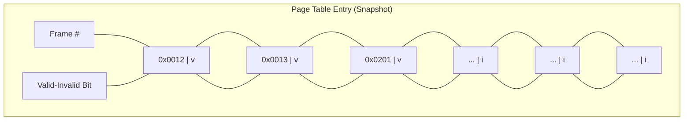
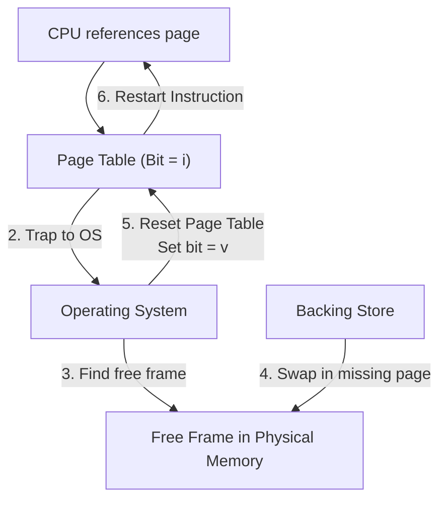
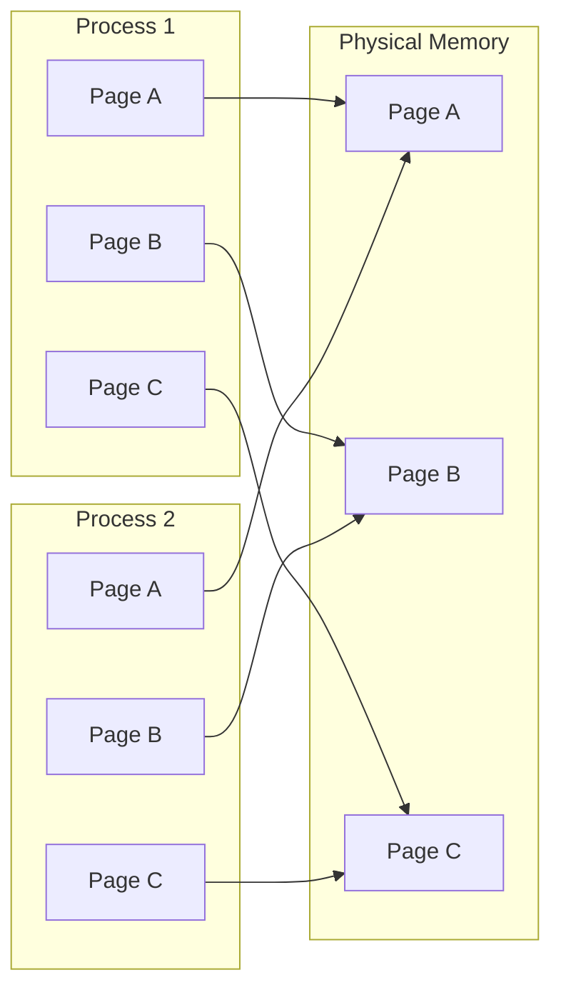
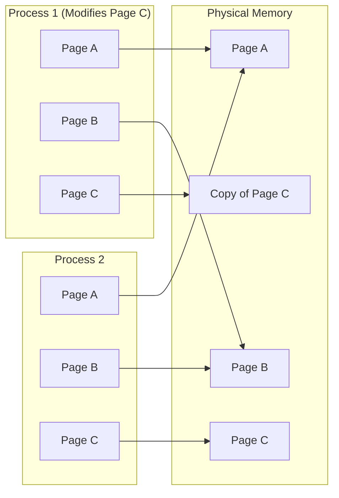
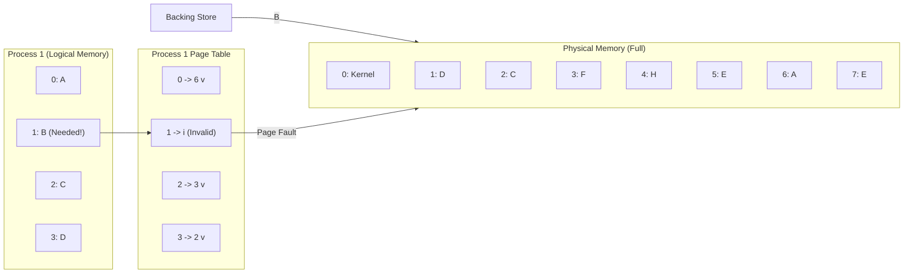
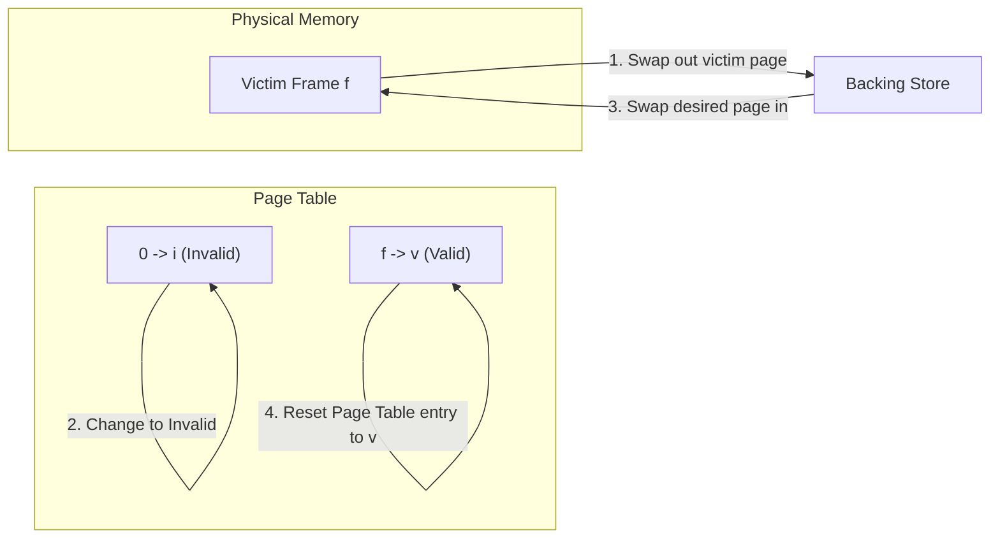
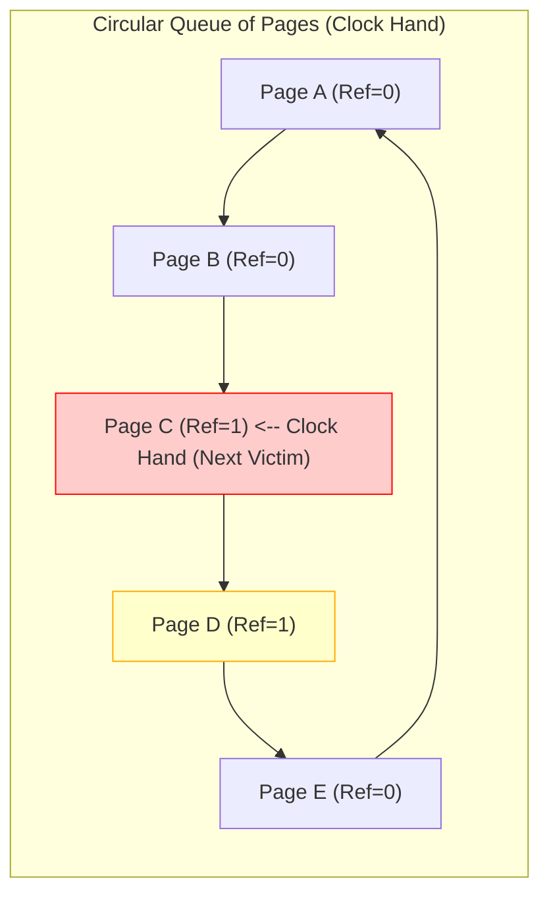

## Topic 1: Virtual Memory Background (Slides 4-7)

### Simple Explanation
Virtual memory is a technique that allows a computer to run programs that are larger than its physical RAM. The OS separates the **logical memory** (what the program sees) from the **physical memory** (what the hardware has). 

Why do we need this?
- Most programs don't use all their code at once (e.g., error-handling routines, large data structures, startup code).
- Virtual memory allows **executing a partially loaded program**. This means:
  1. Programs are no longer limited by physical RAM size.
  2. Each program takes up less memory while running, allowing **more programs to run concurrently**.
  3. Less I/O is needed because we don't have to load/swap entire programs—just the parts being used.

### Why Do We Need It?
Without virtual memory, every process must be entirely loaded into physical memory to execute. If a program is 10 GB and you have 8 GB of RAM, it crashes. With virtual memory, the OS can load only the 1 GB of code the program is actively using, "tricking" the program into thinking it has a massive contiguous logical address space.

### Real-Life Analogy
Imagine a **massive cookbook** (the program). You don't read the entire book to cook one meal. You only pull out the page with the current recipe (virtual memory), read it, and leave the rest on the shelf (disk). You can cook many meals at the same time, only keeping the relevant pages on your counter (physical memory).

---

## Topic 2: Demand Paging & Valid-Invalid Bit (Slides 8-11)

### Simple Explanation
How does virtual memory actually work? Instead of bringing the entire program into RAM at load time, the OS uses **Demand Paging**—it only brings a page into memory **when the CPU actually tries to access it**. This is called a **Lazy Swapper** (or lazy pager). 
To make this work, the page table needs a new feature: a **Valid-Invalid bit** associated with each entry.
- **`v` (Valid):** The page is in physical memory.
- **`i` (Invalid):** The page is *not* in physical memory. 

When the CPU generates a logical address, the MMU checks this bit. If it sees `i`, the hardware triggers a **Page Fault** (a trap to the OS). The OS must now fetch the missing page from the disk before the process can continue.

### Visual Explanation: Valid-Invalid Bit Snapshot (Slide 11)

**Explanation:** The first three pages are valid (`v`) and in memory. The bottom three pages are invalid (`i`)—they are still on the disk. If the CPU tries to access an invalid page, a page fault occurs.

### Page Table When Some Pages Are Not in Main Memory

---

## Topic 3: Page Fault Handling (Slides 13-14)

### Simple Explanation
When a Page Fault occurs, the OS must step in to fix it. Here is the exact 6-step routine the OS follows:

1. The CPU references a page, finds `i` in the page table, and **traps** to the OS.
2. The OS looks at the page table to decide: If the reference was invalid (illegal), it **aborts** the process. If it's just not in memory, it continues.
3. The OS finds a **free frame** (an empty slot in physical RAM).
4. The OS schedules a disk operation to **swap the desired page** into the free frame.
5. The OS resets the page table entry: sets the frame number to the new location and changes the valid-invalid bit to **`v`**.
6. The OS **restarts the instruction** that caused the page fault.

**Pure Demand Paging:** In the extreme case, a process starts with *no pages* in memory. The OS sets the instruction pointer to the first instruction, immediately hits a page fault, loads the page, and continues. This is called "pure demand paging."

### Visual Explanation: Page Fault Steps (Slide 14)

*Note: Step 1 is the reference that causes the initial trap. Step 6 is the CPU retrying the exact same instruction now that the page is valid.*

---

## Topic 4: Copy-on-Write (COW) (Slides 17-19)

### Simple Explanation
When a parent process creates a child process (using the `fork()` system call), copying the entire memory space is very slow and wasteful. **Copy-on-Write (COW)** solves this by making the parent and child **share the exact same physical pages** initially.

- If only one process reads the pages, no copy is ever made.
- **If either process modifies a shared page** (e.g., Process 1 tries to write to Page C), the OS *immediately* creates a private copy of that specific page for the modifying process.
- This allows very efficient process creation, because only the modified pages are actually copied.
- **`vfork()`**: A special variation where the parent is completely suspended, and the child uses the parent's address space. This is highly efficient when the child immediately calls `exec()` to load a new program.

### Visual Explanation: Copy-on-Write Before/After (Slides 18-19)

**Diagram 1: Before Process 1 Modifies Page C**

*Explanation: Both processes' page tables point to the exact same physical frames. No memory is duplicated.*

**Diagram 2: Process 1 Modifies Page C**

*Explanation: When Process 1 tries to write to Page C, the OS copies the frame to a new location. Process 1's table now points to the new copy, while Process 2 still points to the original. This saves massive memory.*

---

## Topic 5: Need for Page Replacement (Slides 20-22)

### Simple Explanation
What happens if we get a page fault but **there are no free frames** in physical memory? The OS cannot load the desired page. 

The solution is **Page Replacement**: The OS selects a *victim frame* (a page currently in memory that is less likely to be used), swaps it out to the backing store, and swaps the desired page into its place. 

**Crucial Optimization (Dirty Bit):** To make this fast, the OS uses a **modify (dirty) bit**. 
- If a page has been modified (dirty bit = 1), it must be written back to disk when replaced.
- If a page has not been modified (dirty bit = 0), it is a clean copy—the OS can just discard it, saving massive disk I/O time.

### Visual Explanation: Need For Page Replacement (Slide 22)

**Explanation:** Process 1 tries to access page `B`, but its page table entry is `i` (invalid). Physical memory is completely full (no free frames). The OS must *replace* an existing frame to make room for `B`.

---

## Topic 6: Page Replacement Steps & Reference String (Slides 23-25)

### Simple Explanation
Once the OS decides to replace a page, it goes through a modified 4-step process:

1. Find the location of the desired page on the backing store.
2. **Find a free frame:**
   - If a free frame exists, use it.
   - If *no* free frame exists, use a replacement algorithm to select a **victim frame**.
   - If the victim frame is **dirty**, write it to disk.
3. Bring the desired page into the freed frame. Update the page and frame tables.
4. Restart the instruction that caused the fault.

### Visual Explanation: Page Replacement (Slide 24)

**Explanation:** Step 1: The victim frame is written to backing store if dirty. Step 2: The OS marks the victim's page table entry as invalid. Step 3: The desired page is swapped into the freed frame. Step 4: The new page table entry is set to valid (`v`).

---

## Topic 7: FIFO & Belady's Anomaly (Slides 26-27)

### Simple Explanation
How do we measure which page replacement algorithm is best? We simulate the algorithm on a **Reference String**—a sequence of page numbers the CPU will request. 

**FIFO (First-In, First-Out):** The simplest algorithm. The OS replaces the page that has been in memory the longest. It's easy to implement with a simple FIFO queue.

**Belady's Anomaly:** In FIFO, occasionally, **adding more frames to physical memory causes *more* page faults**! This defies common logic and is a critical flaw in FIFO.

### Visual Explanation: FIFO Example (Slide 27)
- Reference String: `7, 0, 1, 2, 0, 3, 0, 4, 2, 3, 0, 3, 0, 3, 2, 1, 2, 0, 1, 7, 0, 1`
- Frames = 3. Page Faults = 15.

**Result:** 15 faults. Belady's Anomaly occurs when adding a 4th frame increases faults beyond 15.
Can vary by reference string: consider 1,2,3,4,1,2,5,1,2,3,4,5
- Adding more frames can cause more page faults!
> Belady’s Anomaly
- How to track ages of pages?
> Just use a FIFO queue

### FIFO Illustrating Belady’s Anomaly

---

## Topic 8: Optimal (OPT) Algorithm (Slide 29)

### Simple Explanation
The **Optimal Algorithm (OPT)** replaces the page that will **not be used for the longest period of time in the future**. 

**Important:** We cannot actually implement OPT in a real OS because it requires predicting the future! However, it is used as a **benchmark**—if your algorithm gets close to OPT's page fault count, it's an excellent algorithm.

### Visual Explanation: OPT Example (Slide 29)
*Same reference string, 3 frames. OPT gives 9 page faults.*

---

## Topic 9: LRU (Least Recently Used) (Slides 30-31)

### Simple Explanation
**LRU** uses past knowledge instead of future knowledge. It replaces the page that has **not been used for the longest amount of time** in the past. 

**Performance:** LRU is generally excellent, achieving 12 faults for our example (better than FIFO's 15, worse than OPT's 9).

**Hardware Implementation Problems:** How does the OS track "age"?
- **Counter Implementation:** Each page table entry has a counter. Each time a page is referenced, the current clock time is copied into its counter. When looking for a victim, search the entire table for the smallest counter. (Slow, because you must scan *every* entry).
- **Stack Implementation:** Maintain a doubly-linked stack of page numbers. When a page is referenced, move it to the top of the stack. The bottom of the stack is the victim. (No search required, but updating the stack is expensive in hardware).

### Visual Explanation: LRU Example (Slide 30)
*Same reference string, 3 frames. LRU gives 12 page faults.*

---

## Topic 10: Second-Chance (Clock) Algorithm (Slides 33-35)

### Simple Explanation
Because pure LRU needs expensive hardware, modern OSes use an approximation: the **Second-Chance (Clock) Algorithm**.

- Each page table entry has a **Reference Bit**. Initially set to `0`.
- When a page is referenced, the hardware sets the reference bit to `1`.
- When replacing, the OS scans pages in a circular queue (like a clock hand).
- **Rule:**
  - If the current page's reference bit is `0`, replace it!
  - If the reference bit is `1`, set it to `0` (give it a "second chance") and move to the next page.

**Enhanced Second-Chance (Slide 36):** To make it even better, we pair the Reference bit with the **Modify (Dirty) bit**.
- `(0, 0)`: Clean, not used – **Best page to replace.**
- `(0, 1)`: Dirty, not used – Must write to disk before replacing.
- `(1, 0)`: Clean, used – Probably will be used soon.
- `(1, 1)`: Dirty, used – Worst to replace.

### Visual Explanation: Second-Chance (Clock) Replacement (Slide 35)

**Step 1:** The clock hand points to Page C (Ref=1). It gets a second chance. Set Ref=0. Move hand to Page D.
**Step 2:** Page D (Ref=1) also gets a second chance. Set Ref=0. Move hand to Page E.
**Step 3:** Page E (Ref=0) is the victim! It gets replaced.

---

## Topic 11: Counting Algorithms (Slide 37)

### Simple Explanation
Another way to decide replacement is to count how many times a page has been referenced.

- **Least Frequently Used (LFU):** Replaces the page with the **smallest reference count**. (The logic: the page that has been used the least is probably no longer needed).
- **Most Frequently Used (MFU):** Replaces the page with the **largest reference count**. (The logic: the page with the smallest count was probably just brought in and hasn't been used yet, so it's the most valuable to keep).

**Note:** Counting algorithms are generally **not common** in modern OSes because they require counters for every page, and a page's usage patterns can change dramatically over time (a page used frequently early on may sit idle later, but LFU will refuse to replace it).

---

# Final Lecture Revision Sheet

## Must Remember Definitions (5)
1.  **Virtual Memory:** A technique that separates logical memory from physical memory, allowing processes to run partially loaded.
2.  **Demand Paging:** A paging method where pages are loaded into memory *only* when they are referenced by the CPU.
3.  **Page Fault:** A trap to the OS generated by the MMU when a CPU references a page whose valid-invalid bit is set to `i` (invalid).
4.  **Copy-on-Write (COW):** An optimization where parent and child processes share the exact same physical pages until one of them writes to a page.
5.  **Dirty (Modify) Bit:** A bit in the page table that indicates if a page has been modified. If a dirty page is replaced, it must be written back to disk.
6.  **Belady's Anomaly:** The counter-intuitive phenomenon where increasing the number of frames allocated to a process can *increase* the number of page faults under the FIFO algorithm.

## Most Important Concepts (5)
1.  **Page Fault Handling Steps:** Trap to OS → Check validity → Find free frame (or victim) → Swap page from backing store → Update valid bit → Restart instruction.
2.  **COW Efficiency:** Only modified pages are copied; unmodified pages remain shared. `vfork()` is an extreme version that suspends the parent entirely.
3.  **Replacement Algorithms Comparison:**
    - **FIFO:** Simple, but suffers from Belady's Anomaly.
    - **OPT:** Optimal (minimum faults), but impossible to implement in reality (requires future knowledge).
    - **LRU:** Excellent performance, but requires expensive hardware (counters or stack) to implement.
4.  **Second-Chance (Clock):** An approximation of LRU using Reference bits. Gives pages a second chance before evicting them.
5.  **Enhanced Clock:** Uses both Reference and Modify bits `(Ref, Mod)` to prioritize victims: `(0,0)` > `(0,1)` > `(1,0)` > `(1,1)`.

## Common Exam Traps
- **Trap 1:** Thinking that Page Replacement is only needed when memory is completely full. *Correction:* If there *is* a free frame, replacement is unnecessary—the OS just uses the free frame.
- **Trap 2:** Confusing OPT and LRU. *Correction:* OPT looks *forward* (future); LRU looks *backward* (past).
- **Trap 3:** Assuming the OS writes all victim pages to disk. *Correction:* The Dirty Bit determines this. If a victim is "clean" (bit = 0), the OS just discards it. Writing is a slow operation, avoided whenever possible.
- **Trap 4:** Forgetting that FIFO can suffer from Belady's Anomaly. *Correction:* Remember, "More frames = More faults" is only possible with FIFO, not LRU or OPT.

## One-Page Revision Summary
- **Virtual Memory:** Allows processes to exceed physical RAM. Logical > Physical.
- **Demand Paging:** Lazy loader. Valid bit (`v`/`i`) detects page faults.
- **Page Fault Steps:** Trap → Find Frame → Swap in → Update PTE → Restart.
- **Copy-on-Write:** Share pages until modified. `vfork()` suspends parent.
- **Algorithms:**
  - **FIFO:** Queue. Causes Belady's Anomaly.
  - **OPT:** Perfect, but impossible.
  - **LRU:** Past history. Needs counters/stacks.
  - **Clock:** Circular queue. Reference bit = 1 gives second chance.
  - **Enhanced Clock:** `(Ref, Mod)` pairs.
- **Counting:** LFU (smallest count) / MFU (largest count). Rarely used.

## 5 Practice Questions (Without Answers)
1.  **Page Fault:** A process requests logical address `0x0A5F`. The valid-invalid bit in the page table is `i`. Trace the 6 steps the OS takes to resolve this page fault and restart the process.
2.  **Copy-on-Write:** A parent process creates a child using `fork()`. They share 5 pages. The child modifies Page 2. Draw the memory mapping before and after the modification. Why is this more efficient than copying all 5 pages immediately?
3.  **Replacement Algorithms:** Given the reference string `1, 2, 3, 4, 1, 2, 5, 1, 2, 3, 4, 5` and 3 frames, calculate the number of page faults for FIFO, OPT, and LRU. Which algorithm performs best?
4.  **Belady's Anomaly:** Explain what Belady's Anomaly is. Which page replacement algorithm suffers from it, and why does adding more frames ever increase page faults?
5.  **Second-Chance (Clock):** A circular queue has 4 pages with the following reference bits: `[1, 0, 1, 0]`. The clock hand is currently at the first element (`1`). Trace the algorithm until a victim is chosen. Show how the bits change at each step. Which page gets replaced?