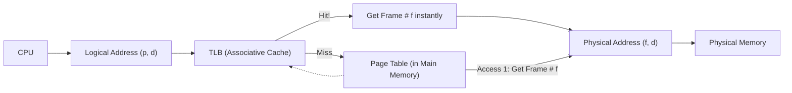
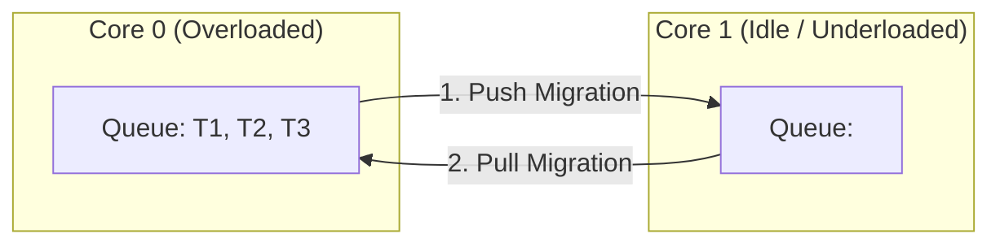
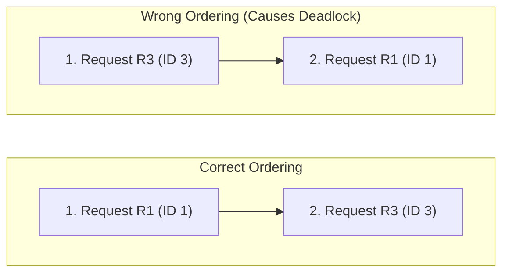

## Q#01: Virtual Memory & Demand Paging (10 Marks, CLO1)

### Part A: OS without Virtual Memory vs OS with Virtual Memory

| Feature | **Without Virtual Memory** | **With Virtual Memory** |
| :--- | :--- | :--- |
| **Program Size** | A process's entire code must fit inside the physical RAM size. | A process's logical address space can be **much larger** than physical RAM. |
| **Concurrency** | Very limited. Only a few processes can run at a time due to RAM limits. | High concurrency. Many more processes can run simultaneously because they only keep active parts in RAM. |
| **I/O & Swapping** | Requires heavy I/O to swap the *entire* process in and out (very slow, seconds). | Only actively used pages are swapped; far less I/O overhead. |
| **Protection** | Base/Limit registers protect processes, but logical and physical addresses are often bound early (less flexible). | Full protection via MMU and logical/physical separation. Allows efficient sharing (reentrant code). |

### Part B: How Demand Paging implements Virtual Memory
Demand paging is the mechanism that makes virtual memory possible. Instead of loading an entire program into memory at start, the OS uses a **lazy swapper**: pages are only brought from the disk into physical memory when the CPU **actually references** them.

**How it works step-by-step:**
1. The CPU generates a logical address, which the MMU splits into `Page Number (p)` and `Offset (d)`.
2. The MMU checks the **Page Table Entry** for that page. It looks at the `Valid-Invalid Bit`. 
3. If the bit is **`v` (Valid)**, the page is in memory, and the MMU translates the address immediately.
4. If the bit is **`i` (Invalid)**, the OS triggers a **Page Fault**.
5. Upon Page Fault, the OS brings the page from the **Backing Store** (disk) into a **free frame**, updates the page table to set the bit to `v`, and restarts the instruction.

**Visual Explanation (Demand Paging Flow):**
```mermaid
flowchart TD
    CPU[CPU generates Logical Address (p,d)] --> MMU[MMU checks Valid-Invalid Bit]
    
    MMU -- "Bit = v (Valid)" --> Hit[Page in Memory]
    Hit --> Translate[Translate to Physical Address]
    Translate --> Access[Access Physical Memory]
    
    MMU -- "Bit = i (Invalid)" --> PageFault[Trap to OS: Page Fault]
    
    PageFault --> Find[Find Free Frame]
    Find -- No Free Frame --> Replace[Use Page Replacement Algorithm]
    Replace --> SwapIn[Swap in desired page from Backing Store]
    Find -- Free Frame Found --> SwapIn
    
    SwapIn --> Update[Update Page Table: Set Bit to v]
    Update --> Restart[Restart the CPU instruction]
    Restart --> CPU
```
*(Note: This is what happens "under the hood" every time you run a large program like a browser or game).*

---

## Q#02: Two-Memory-Access Problem & Solution (10 Marks, CLO2)

### The Problem (Why does this happen?)
In a standard paging system, the **Page Table is stored directly inside Main Memory (RAM)**. Because of this, every single time the CPU wants to fetch a piece of data, the MMU must perform **two memory accesses**:
1. **Access 1:** Read the Page Table from RAM to find the physical Frame Number.
2. **Access 2:** Read the actual Data from that physical Frame number in RAM.

This doubles the memory access time for every instruction, causing a massive drop in performance.

### The Solution: The Translation Look-Aside Buffer (TLB)
The solution is a special, extremely fast hardware cache called the **TLB**. It sits inside the MMU and stores recent `(Page Number, Frame Number)` mappings.

**How the TLB solves the problem:**
- **TLB Hit (Fast):** The MMU checks the TLB. If the page number is found, it immediately retrieves the frame number in **1 CPU clock cycle**. The MMU skips the main memory page table entirely. Memory Access = 1 (just the data).
- **TLB Miss (Slow, but mitigated):** If the page number is not in the TLB, the MMU falls back to the 2-access method (Page Table in RAM, then Data). 
- **Crucial Optimization:** Once a TLB Miss occurs, the OS updates the TLB with the new mapping. The next time that page is accessed, it will be a **TLB Hit**.

**Visual Explanation (TLB Hit vs Miss Flow):**

*(Pro Tip for the teacher: Mention "Associative memory" and "ASID" to get full extra marks for advanced understanding!)*

---

## Q#03: 5 Real-World Memory Allocation Problems (10 Marks, CLO3)

**1. External Fragmentation in Server Databases**
- **Real-world example:** A large-scale SQL database server continuously allocates and deallocates memory for query processing. 
- **Justification:** After running for a few weeks, the physical memory has 2 GB of free space total, but the largest contiguous block is only 200 MB. The OS cannot allocate a 1 GB query buffer because free space is scattered (External Fragmentation), causing server performance degradation.

**2. Internal Fragmentation in Paging (Last Page Wastage)**
- **Real-world example:** A small embedded device running a lightweight process. The process needs exactly 500 bytes, but the OS page size is 4,096 bytes.
- **Justification:** The OS must allocate a whole 4 KB frame. The remaining 3,596 bytes of that frame are completely wasted and locked inside the partition (Internal Fragmentation). On a constrained device, this quickly eats up available RAM.

**3. I/O Blocking during Memory Compaction**
- **Real-world example:** An OS scheduler attempts to compact memory to merge external fragments, but a running process is currently writing a file to a disk through Direct Memory Access (DMA).
- **Justification:** Compaction moves processes around. If the OS tries to move a process that is currently doing I/O, the disk controller will write data to the *old* physical address, corrupting the file. The OS must pause I/O or use OS buffers, significantly slowing down the system.

**4. Thrashing (Over-allocation of Virtual Memory)**
- **Real-world example:** A user opens 50 tabs in a web browser with heavy media content on a laptop with only 8 GB of RAM.
- **Justification:** The OS allocates more virtual memory than physical RAM. It enters a state of **thrashing** where the CPU spends 90% of its time swapping pages in and out of the disk instead of executing processes. The laptop becomes completely unresponsive.

**5. Out-of-Memory (OOM) Killer on Mobile OS**
- **Real-world example:** An Android user opens a high-end 3D game, but the system memory is exhausted. The Android OS triggers its Low Memory Killer (LMK).
- **Justification:** Unlike desktop OSes, mobile OSes avoid swapping on flash due to limited write cycles. When memory is fully allocated, the OS brutally **terminates** background apps (like a music player) to free up memory for the game—impacting user experience.

---

## Q#04: 5 Examples of Deadlocks in Real Life (10 Marks, CLO3)

**1. The 4-Way Intersection (Circular Wait & Mutual Exclusion)**
- **Scenario:** Four cars arrive at a 4-way stop sign exactly at the same time, each waiting for the car on their right to go first.
- **Justification:** This is a pure **Circular Wait**. Car A waits for B, B waits for C, C waits for D, and D waits for A. Since the intersection is a **Mutual Exclusion** resource (only one car enters at a time), they are deadlocked forever until an external factor (a human waving) breaks the cycle.

**2. The Screwdriver and Hammer Problem (Hold and Wait)**
- **Scenario:** Two workers are assembling furniture. Worker 1 grabs the screwdriver and waits for the hammer. Worker 2 grabs the hammer and waits for the screwdriver.
- **Justification:** This satisfies **Hold and Wait** (both hold one tool while waiting for the other) and **No Preemption** (you cannot forcefully rip a tool from a worker's hand). Neither can finish their task.

**3. The Projector Cable Conflict (No Preemption)**
- **Scenario:** At a university, Professor A holds the HDMI cable for the projector and is waiting for a power strip. Professor B holds the power strip and is waiting for the HDMI cable.
- **Justification:** The resource (cables) is **Non-Preemptible** (you can't just cut the cable to take it). Neither professor will voluntarily release their cable, leading to a stalemate before the lecture begins.

**4. The Elevator Trap (Mutual Exclusion)**
- **Scenario:** Person A is inside a crowded elevator blocking the door to let Person B out. Person B is blocking Person A from leaving because Person B is trying to enter. 
- **Justification:** The elevator door area acts as a **Mutual Exclusion** resource. Person A is stuck holding space inside the elevator (holding a resource) while Person B is blocking the exit (circular wait). They are deadlocked.

**5. The Shared Toilet Paper Standoff (Hold and Wait)**
- **Scenario:** In a shared office restroom, Person 1 holds the last full roll of toilet paper and is waiting for the empty cardboard tube holder to be freed up. Person 2 holds the empty cardboard tube holder and is waiting for the full roll.
- **Justification:** Both are holding one resource and waiting for the other. Since neither can finish without the other's resource, they are deadlocked until an external manager (OS) steps in to resolve the situation.

---

## Q#05: Threading Model of Windows OS (10 Marks, CLO2)

**1. Priority-Based Preemptive Scheduling**
Windows uses a strict **priority-based preemptive scheduler**. The **dispatcher** always runs the ready thread with the absolute highest priority. A lower-priority thread is instantly preempted by any higher-priority thread that wakes up.

**2. The 32-Level Priority Scheme**
Priorities range from **0 to 31**:
- **Priority 0:** Reserved exclusively for the zero-page memory-management thread.
- **Priority 1 - 15 (Variable Class):** Normal processes. Priorities are dynamically boosted/lowered based on recent behavior (e.g., I/O wait).
- **Priority 16 - 31 (Real-Time Class):** Time-critical threads. **These cannot be preempted or lowered** by the OS.

**3. Priority Classes and Relative Priorities**
Windows processes belong to a `Priority Class` (e.g., `REALTIME`, `HIGH`, `NORMAL`, `IDLE`). Inside each class, threads have a `Relative Priority` (e.g., `TIME_CRITICAL`, `HIGHEST`, `NORMAL`, `LOWEST`). 
Combining these gives the exact numeric priority (e.g., `REALTIME_PRIORITY_CLASS` + `TIME_CRITICAL` = Priority 31).

**4. Priority Boost Mechanism**
- **I/O Completion:** If a thread waits for I/O (e.g., a keyboard press, disk read), it gets a priority boost so it can process the result immediately. 
- **Foreground Window (3x Boost):** The currently active, visible window (foreground app) gets a **3x priority boost** to keep the UI feeling snappy and responsive to users.

**5. SMT Sets (Hyperthreading Awareness)**
Windows is hyperthreading-aware. It groups logical processors that share the same physical core into **SMT sets** (e.g., `{0,1}`, `{2,3}` for a dual-core, hyperthreaded system). 
Windows tries to schedule threads on different physical cores first, before using the sibling thread on the same core, to avoid cache contention and maximize parallelism.

---

## Q#06: CPU Scheduling in a Multiprocessor Environment (10 Marks, CLO2)

Scheduling in a multiprocessor environment (SMP - Symmetric Multiprocessing) is much more complex than a single CPU because we have multiple identical cores that must be kept efficiently busy.

**1. Common Ready Queue vs Per-CPU Run Queues**
- **Common Queue:** All threads go into one global queue; cores pick the next thread. (Simple, but leads to queue lock contention and cache misses).
- **Per-CPU Queues:** Each core has its own private queue. (Better cache, but leads to load imbalance).

**2. Load Balancing (Push vs Pull Migration)**
To ensure all cores are used effectively, the OS performs load balancing:
- **Push Migration:** A specialized OS task runs periodically. If it detects Core 0 is overloaded while Core 1 is idle, it *pushes* a task from Core 0 over to Core 1.
- **Pull Migration:** If Core 1 becomes idle, it actively *pulls* a waiting task from Core 0's busy queue.

**3. Processor Affinity (The Cache Problem)**
When a thread runs on a specific core, that core's **cache** is populated with the thread's data. 
- **Soft Affinity:** The OS *prefers* to keep the thread on the same core, but may move it for load balancing.
- **Hard Affinity:** The programmer/system explicitly forces the thread to run on a specific set of cores using system calls.
- **Trade-off:** Load balancing must be balanced against destroying cache locality. Moving a thread makes it "cache cold," causing massive performance hits.

**4. NUMA (Non-Uniform Memory Access)**
Modern server systems have multiple CPUs, each with its own local memory. Accessing local memory is **fast**; accessing memory from another CPU is **slow**. 
A **NUMA-aware scheduler** tries to allocate memory physically close to the CPU the thread is running on to minimize slow interconnects.

**Visual Explanation (Push vs Pull Migration):**


---

## Q#07: Deadlock Prevention (10 Marks, CLO3)

Deadlock requires **4 necessary conditions** to happen simultaneously. Deadlock **Prevention** means designing the OS to break *at least one* of these conditions so deadlocks become physically impossible.

**1. Break Mutual Exclusion**
- **How:** Allow multiple processes to access resources simultaneously if possible (e.g., read-only files).
- **Limitation:** This is impossible for non-sharable resources (like a printer). You cannot give two people access to a physical printer at the exact same time. 

**2. Break Hold and Wait**
- **How:** A process must request **ALL** its resources at the very beginning, before it starts executing. Or, it can only request resources when it holds exactly 0 resources.
- **Limitation:** This leads to **low resource utilization** and **starvation**. A process may hold a printer for 5 hours but never use it, blocking others.

**3. Break No Preemption**
- **How:** If a process requests a resource and it is held by another process, the OS **forcibly preempts** all resources currently held by the requesting process. The process is restarted later.
- **Limitation:** Constantly restarting processes wastes massive amounts of CPU work.

**4. Break Circular Wait**
- **How:** Assign a **global total ordering** to all resource types. For example, `Resource A (ID=1)`, `Resource B (ID=2)`, `Resource C (ID=3)`. 
- **The Rule:** A process must request resources in **strictly increasing order** (e.g., it can request A then C, but never C then A). 
- **Why it works:** This creates a one-way street. If every process requests resources in increasing ID order, a cycle can never form.

**Visual Explanation (Breaking Circular Wait):**

*(Explanation: The OS forces all processes to use the "Correct Ordering" path. Since process can't go backwards down the ID list, a circular loop is structurally impossible).*

---
