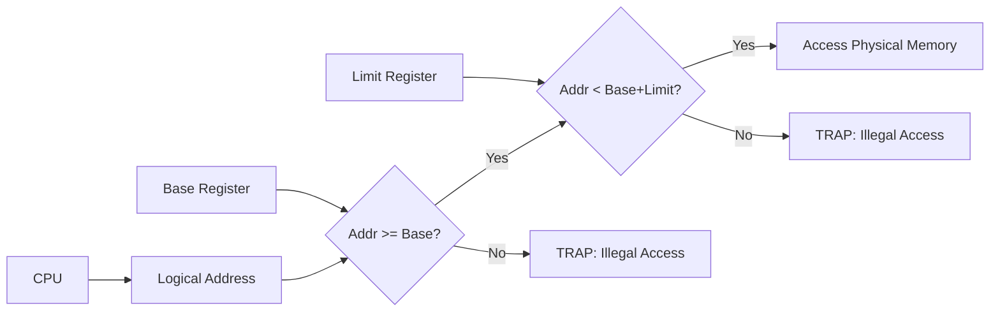

## Q#1: Find average waiting time and average turnaround time using preemptive priority scheduling. A lower number indicates higher priority. (CLO2, 10 Marks)

**Given Data:**
- Rule: Preemptive Priority. Lower Priority Number = Higher Priority.
- Processes: P1 (10ms, Pr 3), P2 (1ms, Pr 1), P3 (2ms, Pr 4), P4 (1ms, Pr 5), P5 (5ms, Pr 2).

### Step 1: Execution Timeline & Gantt Chart
Let's trace the execution step-by-step:
- **t = 0:** P1 arrives and starts running (Pr 3).
- **t = 1:** P2 arrives (Pr 1, which is higher than P1's Pr 3). **P2 preempts P1.** P1 has 9ms remaining. P2 starts running.
- **t = 2:** P3 arrives (Pr 4). P2 (Pr 1) is still the highest priority, so it continues.
- **t = 3:** P4 arrives (Pr 5). P2 (Pr 1) continues.
- **t = 4:** P5 arrives (Pr 2). P2 (Pr 1) continues.
- **t = 5:** P2 finishes its 1ms burst.
- **t = 5:** Ready queue has P5 (Pr 2), P1 (Pr 3), P3 (Pr 4), P4 (Pr 5). P5 has the highest priority, so it runs.
- **t = 10:** P5 finishes its 5ms burst.
- **t = 10:** Ready queue has P1 (Pr 3), P3 (Pr 4), P4 (Pr 5). P1 runs.
- **t = 19:** P1 finishes its remaining 9ms burst.
- **t = 19:** Ready queue has P3 (Pr 4), P4 (Pr 5). P3 runs.
- **t = 21:** P3 finishes its 2ms burst.
- **t = 21:** P4 runs.
- **t = 22:** P4 finishes its 1ms burst.

**Gantt Chart Text View:**
`0 [P1] 1 [P2] 5 [P5] 10 [P1] 19 [P3] 21 [P4] 22`

### Step 2: Calculate Turnaround Time (TAT) and Waiting Time (WT)
- **Turnaround Time (TAT)** = Completion Time (CT) – Arrival Time (AT)
- **Waiting Time (WT)** = TAT – Burst Time (BT)

| Process | Arrival Time (AT) | Burst Time (BT) | Completion Time (CT) | Turnaround Time (TAT) | Waiting Time (WT) |
| :--- | :--- | :--- | :--- | :--- | :--- |
| **P1** | 0 | 10 | 19 | 19 – 0 = **19** | 19 – 10 = **9** |
| **P2** | 1 | 1 | 5 | 5 – 1 = **4** | 4 – 1 = **3** |
| **P3** | 2 | 2 | 21 | 21 – 2 = **19** | 19 – 2 = **17** |
| **P4** | 3 | 1 | 22 | 22 – 3 = **19** | 19 – 1 = **18** |
| **P5** | 4 | 5 | 10 | 10 – 4 = **6** | 6 – 5 = **1** |

### Step 3: Compute Averages
- **Average Turnaround Time** = `(19 + 4 + 19 + 19 + 6) / 5 = 67 / 5 = **13.4 ms**`
- **Average Waiting Time** = `(9 + 3 + 17 + 18 + 1) / 5 = 48 / 5 = **9.6 ms**`

---

## Q#2: Discuss CPU scheduling mechanism in Windows OS. Also write names of priority and relative priority classes in Windows OS. (CLO3, 10 Marks)

**Answer:**
Windows uses a **priority-based preemptive scheduling** mechanism. The **Dispatcher** ensures that the highest-priority ready thread always runs. If a higher-priority thread becomes ready, it instantly preempts a lower-priority thread.

**1. The 32-Level Priority Scheme:**
- **Priority 0:** Reserved for the zero-page memory-management thread.
- **Priority 1–15:** **Variable class**. Priorities of threads in this range can be dynamically boosted/lowered by the OS based on their behavior.
- **Priority 16–31:** **Real-time class**. Priorities in this range are static and never lowered (used for time-critical applications).

**2. Priority Classes (Process level):**
A process belongs to one of these classes:
- `REALTIME_PRIORITY_CLASS`
- `HIGH_PRIORITY_CLASS`
- `ABOVE_NORMAL_PRIORITY_CLASS`
- `NORMAL_PRIORITY_CLASS` (Default)
- `BELOW_NORMAL_PRIORITY_CLASS`
- `IDLE_PRIORITY_CLASS`

**3. Relative Priorities (Thread level):**
Inside a priority class, a thread is assigned one of these relative priorities to tweak its numeric level:
- `TIME_CRITICAL`
- `HIGHEST`
- `ABOVE_NORMAL`
- `NORMAL`
- `BELOW_NORMAL`
- `LOWEST`
- `IDLE`

**4. Priority Boost Mechanism:**
- **Foreground Boost:** The currently active interactive window receives a **3x priority boost** to ensure the UI feels snappy.
- **I/O Completion:** Threads waiting for I/O (disk reads, keyboard input) are boosted when the I/O finishes so they can process the data immediately.

---

## Q#3: Consider the following snapshot of a system... (CLO2, 10 Marks)

**Given Data:**
- `Available` = `[1, 5, 2, 0]` (Resources A, B, C, D)

| Process | Allocation (A,B,C,D) | Max (A,B,C,D) |
| :--- | :--- | :--- |
| **P0** | 0, 0, 1, 2 | 0, 0, 1, 2 |
| **P1** | 1, 0, 0, 0 | 1, 7, 5, 0 |
| **P2** | 1, 3, 5, 4 | 2, 3, 5, 6 |
| **P3** | 0, 6, 3, 2 | 0, 6, 5, 2 |
| **P4** | 0, 0, 1, 4 | 0, 6, 5, 6 |

### a. What is the content of the matrix Need?
*Formula: Need = Max – Allocation*

| Process | Need Matrix (A,B,C,D) | Calculation |
| :--- | :--- | :--- |
| **P0** | **0, 0, 0, 0** | 0-0, 0-0, 1-1, 2-2 |
| **P1** | **0, 7, 5, 0** | 1-1, 7-0, 5-0, 0-0 |
| **P2** | **1, 0, 0, 2** | 2-1, 3-3, 5-5, 6-4 |
| **P3** | **0, 0, 2, 0** | 0-0, 6-6, 5-3, 2-2 |
| **P4** | **0, 6, 4, 2** | 0-0, 6-0, 5-1, 6-4 |

### b. Is the system in a safe state? Compute safe sequence.
Let `Work = Available = [1, 5, 2, 0]` and `Finish = [F, F, F, F, F]`.
1. **Check P0:** Need `0 0 0 0 <= Work 1 5 2 0`. Yes.
   - `Work = Work + Allocation(P0)` = `1 5 2 0 + 0 0 1 2 = **1 5 3 2**`. Finish[P0] = True.
2. **Check P2:** Need `1 0 0 2 <= Work 1 5 3 2`. Yes.
   - `Work = Work + Allocation(P2)` = `1 5 3 2 + 1 3 5 4 = **2 8 8 6**`. Finish[P2] = True.
3. **Check P3:** Need `0 0 2 0 <= Work 2 8 8 6`. Yes.
   - `Work = Work + Allocation(P3)` = `2 8 8 6 + 0 6 3 2 = **2 14 11 8**`. Finish[P3] = True.
4. **Check P1:** Need `0 7 5 0 <= Work 2 14 11 8`. Yes.
   - `Work = Work + Allocation(P1)` = `2 14 11 8 + 1 0 0 0 = **3 14 11 8**`. Finish[P1] = True.
5. **Check P4:** Need `0 6 4 2 <= Work 3 14 11 8`. Yes.
   - `Work = Work + Allocation(P4)` = `3 14 11 8 + 0 0 1 4 = **3 14 12 12**`. Finish[P4] = True.

**Conclusion:** Since all `Finish[i] == True`, the system is in a **Safe State**. 
**Safe Sequence:** `< P0, P2, P3, P1, P4 >`.

### c. If a request from process P1 arrives for `(0, 4, 2, 0)`, can the request be granted immediately?
**Step 1: Check Request `<=` Need.**
`0 4 2 0 <= 0 7 5 0`. **Yes.**

**Step 2: Check Request `<=` Available.**
`0 4 2 0 <= 1 5 2 0`. **Yes.**

**Step 3: Pretend to allocate and run Safety Algorithm.**
- New Available = `1 5 2 0 - 0 4 2 0 = [1, 1, 0, 0]`
- New Allocation(P1) = `1 0 0 0 + 0 4 2 0 = [1, 4, 2, 0]`
- New Need(P1) = `0 7 5 0 - 0 4 2 0 = [0, 3, 3, 0]`

**Safety Check with pretend state:**
- `Work = 1 1 0 0`.
- **P0:** Need `0 0 0 0 <= 1 1 0 0`. Work = `1 1 0 0 + 0 0 1 2 = [1, 1, 1, 2]`.
- **P2:** Need `1 0 0 2 <= 1 1 1 2`. Work = `1 1 1 2 + 1 3 5 4 = [2, 4, 6, 6]`.
- **P3:** Need `0 0 2 0 <= 2 4 6 6`. Work = `2 4 6 6 + 0 6 3 2 = [2, 10, 9, 8]`.
- **P1:** Need `0 3 3 0 <= 2 10 9 8`. Work = `2 10 9 8 + 1 4 2 0 = [3, 14, 11, 8]`.
- **P4:** Need `0 6 4 2 <= 3 14 11 8`. Work = `3 14 11 8 + 0 0 1 4 = [3, 14, 12, 12]`.

**Conclusion:** All processes can finish. Therefore, the system is safe. **The request CAN be granted immediately.**

---

## Q#4: Consider the page reference string... (CLO3, 5+5 Marks)

**Reference String:** `1, 2, 3, 4, 2, 1, 5, 6, 2, 1, 2, 3, 7, 6, 3, 2, 1, 2, 3, 6`
**Frames available:** 4. Initially empty.

### a. Simple LRU replacement without reference bit, modification bit and chance.

*(LRU Rule: Move the referenced page to the most recent position. Evict the page at the very back).*

| Step | Reference | Frames in Memory (Most Recent -> Least Recent) | Page Fault? |
| :--- | :--- | :--- | :--- |
| 1 | **1** | [1] | **Fault 1** |
| 2 | **2** | [2, 1] | **Fault 2** |
| 3 | **3** | [3, 2, 1] | **Fault 3** |
| 4 | **4** | [4, 3, 2, 1] | **Fault 4** |
| 5 | 2 | [2, 4, 3, 1] | Hit |
| 6 | 1 | [1, 2, 4, 3] | Hit |
| 7 | **5** | [5, 1, 2, 4] – Evicts 3 | **Fault 5** |
| 8 | **6** | [6, 5, 1, 2] – Evicts 4 | **Fault 6** |
| 9 | 2 | [2, 6, 5, 1] | Hit |
| 10 | 1 | [1, 2, 6, 5] | Hit |
| 11 | 2 | [2, 1, 6, 5] | Hit |
| 12 | **3** | [3, 2, 1, 6] – Evicts 5 | **Fault 7** |
| 13 | **7** | [7, 3, 2, 1] – Evicts 6 | **Fault 8** |
| 14 | **6** | [6, 7, 3, 2] – Evicts 1 | **Fault 9** |
| 15 | 3 | [3, 6, 7, 2] | Hit |
| 16 | 2 | [2, 3, 6, 7] | Hit |
| 17 | **1** | [1, 2, 3, 6] – Evicts 7 | **Fault 10** |
| 18 | 2 | [2, 1, 3, 6] | Hit |
| 19 | 3 | [3, 2, 1, 6] | Hit |
| 20 | 6 | [6, 3, 2, 1] | Hit |

**LRU Total Page Faults = 10**

### b. Write Java / Python / C++ code for part a.
Here is a clean, exam-ready **Python** implementation of the LRU page replacement algorithm:

```python
def lru_page_replacement(reference_string, num_frames):
    frames = []      # Stores pages currently in memory (Most Recent at end, Least Recent at front)
    page_faults = 0

    print("Step\tPage\tFrames\t\t\tFault?")
    for i, page in enumerate(reference_string):
        if page in frames:
            # It's a HIT: remove the page and append it to the end (mark as most recently used)
            frames.remove(page)
            frames.append(page)
            fault = "Hit"
        else:
            # It's a FAULT
            page_faults += 1
            if len(frames) >= num_frames:
                # Frames are full: pop the front (Least Recently Used)
                frames.pop(0)
            frames.append(page)
            fault = "Fault"
        
        # Print the current step
        print(f"{i+1}\t{page}\t{str(frames):<20}\t{fault}")
    
    return page_faults

# Driver Code
ref_string = [1, 2, 3, 4, 2, 1, 5, 6, 2, 1, 2, 3, 7, 6, 3, 2, 1, 2, 3, 6]
frames_count = 4
faults = lru_page_replacement(ref_string, frames_count)

print(f"\nTotal Page Faults = {faults}")
```

*(Teacher's Bonus Point Note: Mentioning that the `remove()` function is \(O(n)\) in Python, so a double-linked list + hashmap is faster in production, shows deep understanding).*

---

## Q#5: How OS provides memory protection in contiguous and non-contiguous memory allocation techniques? (CLO3, 10 Marks)

**Answer:**

**1. Contiguous Allocation Protection (Base & Limit Registers):**
In contiguous allocation, the OS uses a pair of hardware registers: **Base Register** and **Limit Register**. 
- **Base Register:** Contains the starting physical address of the process.
- **Limit Register:** Contains the size/range of the process.
- **How it works:** Every time the CPU generates a logical address, the hardware checks: 
  - **Condition 1:** `Logical Address >= Base Register` 
  - **Condition 2:** `Logical Address < Base Register + Limit Register`
- If either condition fails, the hardware triggers a **Trap (Illegal Addressing Error)** and hands control to the OS. Since loading these registers is a **privileged instruction**, user processes cannot modify their own memory boundaries.

**Visual Explanation (Contiguous):**


**2. Non-Contiguous Allocation (Paging) Protection:**
In paging, protection is done at the **Page Table Entry (PTE)** level. Each entry contains specific bits:
- **Valid-Invalid Bit:** If the bit is `1 (Valid)`, the page is in the process's logical address space and can be accessed. If `0 (Invalid)`, any access immediately causes a trap to the OS (illegal reference).
- **Protection Bits (Read/Write/Execute):** Additional bits determine if a particular page can be read, written to, or executed. (e.g., a code page might be "read-only" and "execute-only", and attempting to write to it causes a trap).
- **ASID (Address Space Identifier):** In TLBs, ASIDs ensure that cached mappings from one process cannot be falsely accessed by another process.

---

## Q#6: How we can prevent from deadlocks in computer systems. Explain with examples. (CLO2, 10 Marks)

**Answer:**
Deadlock **Prevention** works by breaking at least one of the 4 necessary conditions for deadlock (Mutual Exclusion, Hold and Wait, No Preemption, Circular Wait). If even one is missing, deadlocks are physically impossible.

**1. Break Mutual Exclusion (ME):**
- **How:** Allow resources to be fully shareable, not exclusive.
- **Example:** Make data files read-only so multiple processes can access them simultaneously.
- **Limitation:** Some resources (like a physical printer) simply cannot be shared due to physical limitations.

**2. Break Hold and Wait (H&W):**
- **How:** A process must request **ALL** its required resources at the very beginning before it starts executing. OR, it can request resources only when it holds exactly zero resources.
- **Example:** A process needing a Printer and a Scanner must request `Request(Printer, Scanner)` right at startup.
- **Limitation:** Low resource utilization (a process holds a printer for 5 hours without using it) and risk of **starvation**.

**3. Break No Preemption (NP):**
- **How:** If a process requests a resource held by another, the OS **forcibly preempts** all resources currently held by the *requesting* process.
- **Example:** Process A holds Printer, requests Scanner. Process B holds Scanner. The OS forcibly takes the Printer from A, puts A to sleep, and allows A to be restarted later when it can get both resources back.
- **Limitation:** Wastes massive CPU time restarting processes.

**4. Break Circular Wait (CW):**
- **How:** Impose a **global total ordering** on all resource types. Require every process to request resources in **strictly increasing order** of their ID.
- **Example:** `Resource A (ID=1)`, `Resource B (ID=2)`, `Resource C (ID=3)`. A process is allowed to request `A -> C`, but is **forbidden** from requesting `C -> A`.
- **Why it works:** This creates a one-way street. If every process asks for resources in increasing order, a circular loop becomes structurally impossible.

**Visual Explanation (Breaking Circular Wait):**
```mermaid
graph LR
    subgraph Allowed["Correct: Allowed Request Order"]
        direction LR
        R1[R1 (ID:1)] --> R2[R2 (ID:2)]
        R2 --> R3[R3 (ID:3)]
    end
    
    subgraph Forbidden["Incorrect: Disallowed Order"]
        direction LR
        R3b[R3 (ID:3)] -- "Blocked by OS" --> R1b[R1 (ID:1)]
    end
```